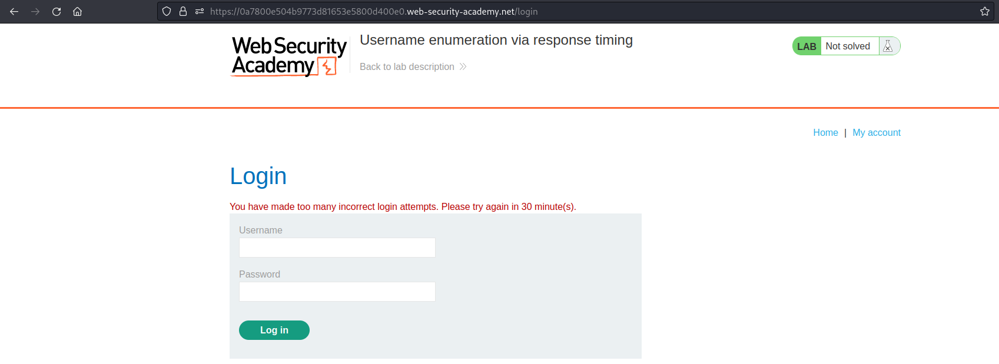
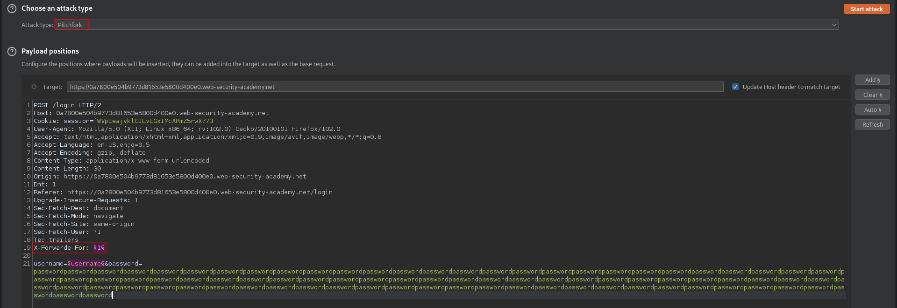
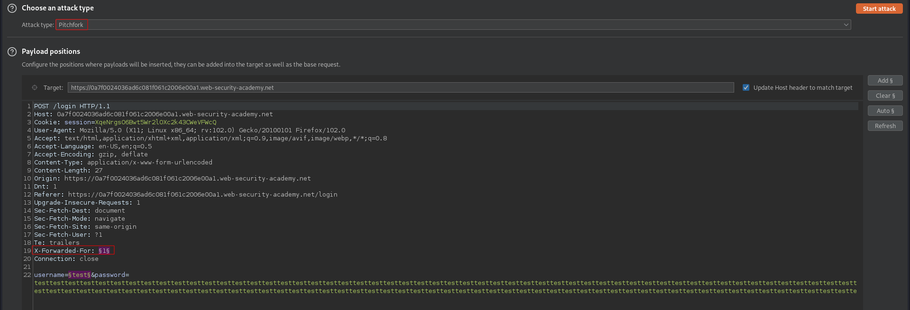
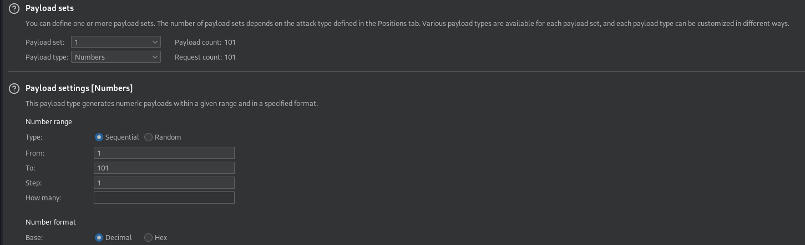
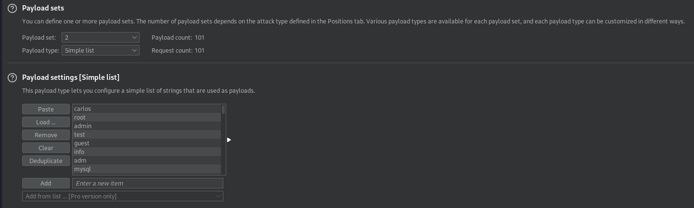
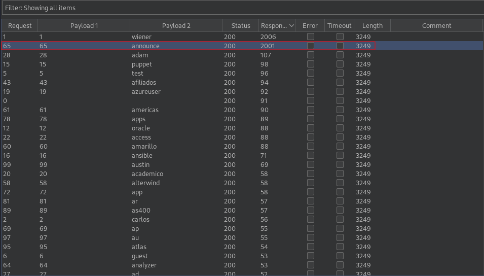
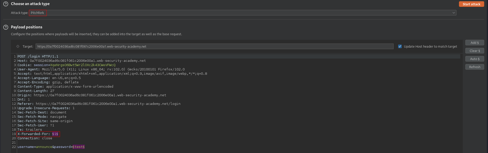
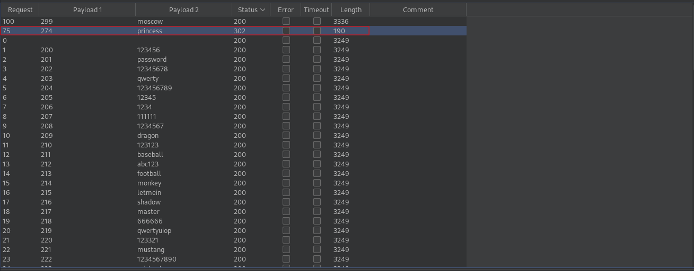

# Username enumeration via response timing
# Objective
This lab is vulnerable to username enumeration using its response times. To solve the lab, enumerate a valid username, brute-force this user's password, then access their account page.
- Your credentials: wiener:peter
- [username.txt](https://portswigger.net/web-security/authentication/auth-lab-usernames) 
- [passwords.txt](https://portswigger.net/web-security/authentication/auth-lab-passwords) 

# Solution
In this lab user IP will be blocked if you he makes too many invalid login attempts.
||
|:--:| 
| *Blocked login* |

In order to bypass blocked IP a X-Forwarded-For header can be used with incorrect IP address. Moreover this application checks provided password only if the username was correct, therefore it is better to set password to long string. In whis way there will be more noticeable time difference amongst responses.

## Username enumeration
||
|:--:| 
| *Payloads positions* |
||
| *Payloads positions* |
||
| *Payload set 1* |
||
| *Payload set 2* |
||
| *Username enumeration results* |

## Password brute-force
||
|:--:| 
| *Payloads positions* |
||
| *Brute-forced password - princess* |