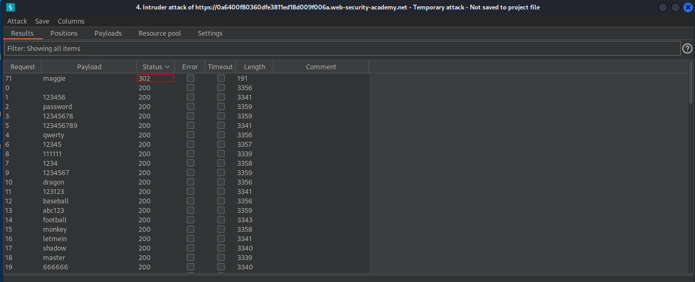

# Username enumeration via subtly different responses
# Objective
This lab is subtly vulnerable to username enumeration and password brute-force attacks. It has an account with a predictable username and password, which can be found in the following wordlists:
- [username.txt](https://portswigger.net/web-security/authentication/auth-lab-usernames) 
- [passwords.txt](https://portswigger.net/web-security/authentication/auth-lab-passwords) 

To solve the lab, enumerate a valid username, brute-force this user's password, then access their account page.

# Solution
## Username Enumeration
||
|:--:| 
| *Payload position* |
||
| *Grep-Extract setings* |
||
| *Different respose - no full stop at the end* |

Valid username is academico

## Password brute-force
||
|:--:| 
| *Payload position* |
||
| *Brute-forced password - maggie* |