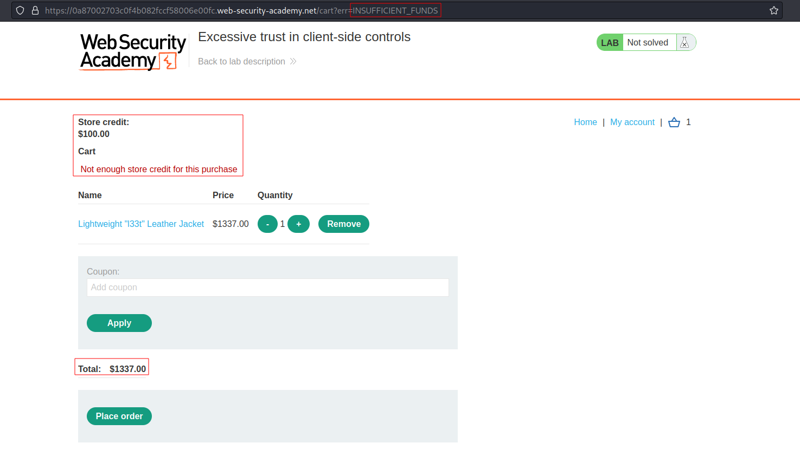
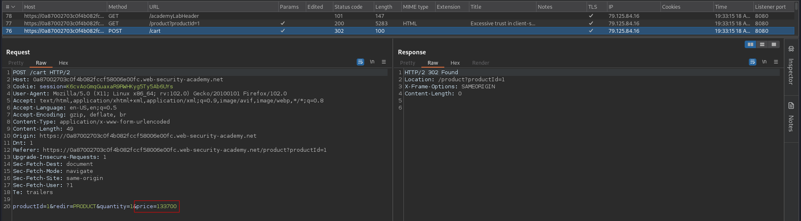
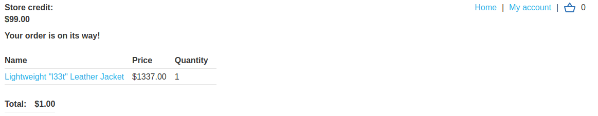

# Excessive trust in client-side controls
# Objective
This lab doesn't adequately validate user input. You can exploit a logic flaw in its purchasing workflow to buy items for an unintended price. To solve the lab, buy a "Lightweight l33t leather jacket".

You can log in to your own account using the following credentials: `wiener:peter`

# Solution
## Analysis
Initially application do not allow to buy item which price is above `Store credit`.
||
|:--:| 
| *Item is too expensive* |

## Exploitation
Modification of the `Add to cart` request allows to change the price of a selected item.

||
|:--:| 
| *Original request that adds to cart selected selected item* |
||
| *Modified request - price is set to 1$* |
||
| *Result - price is set to 1$* |