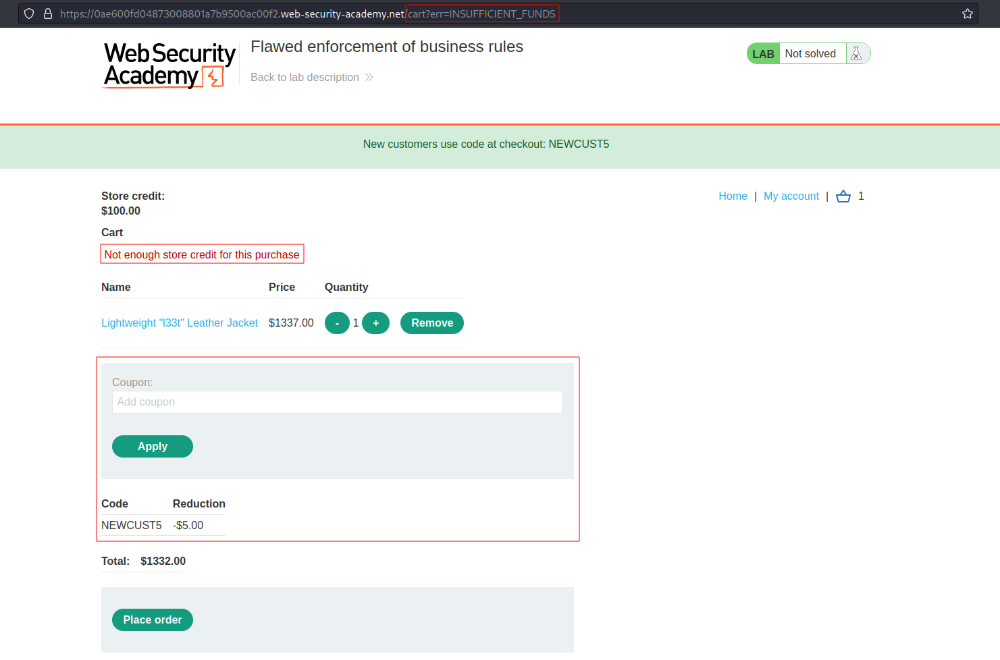
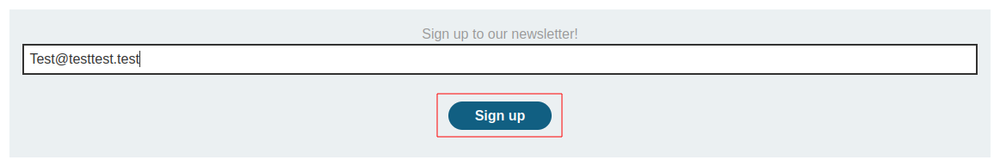
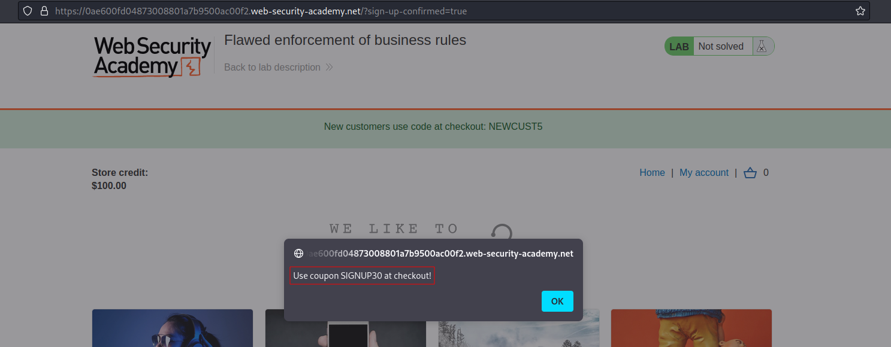
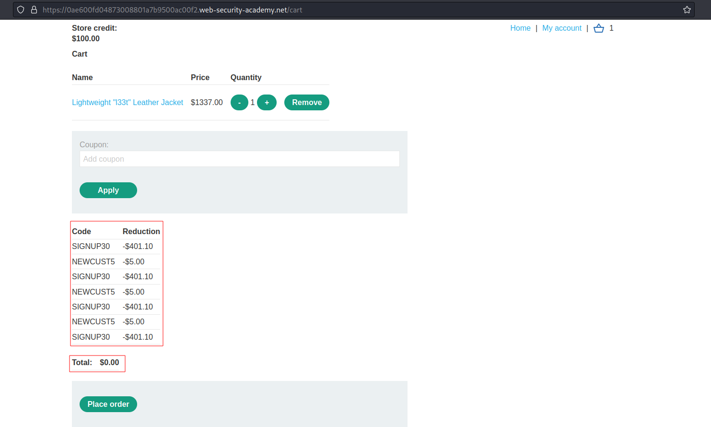

# Flawed enforcement of business rules
# Objective
This lab has a logic flaw in its purchasing workflow. To solve the lab, exploit this flaw to buy a "Lightweight l33t leather jacket".

You can log in to your own account using the following credentials: wiener:peter

# Solution
## Analysis
Initially application do not allow to buy item which price is above `Store credit`. There is special discount coupon functionality. Initially coupon can not by applied more than once. Moreover, signing up to newsletter gives another discount coupon.

||
|:--:| 
| *Item is too expensive* |
||
| *Option to sign up to newsletter* |
||
| *Sign up coupon* |

Available coupons:
```
NEWCUST5
SIGNUP30
```

## Exploitation
Alternating these two coupons allow to use them multiple times.

||
|:--:| 
| *Result of alternating coupons* |
