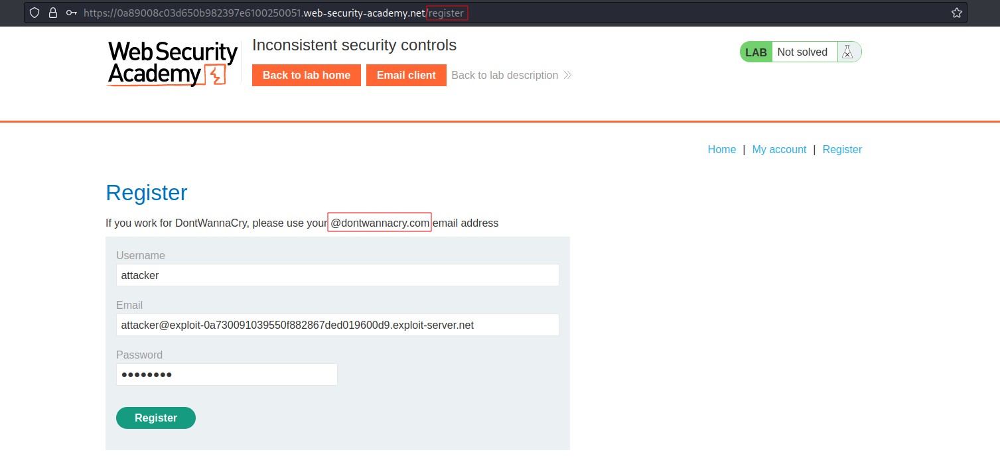
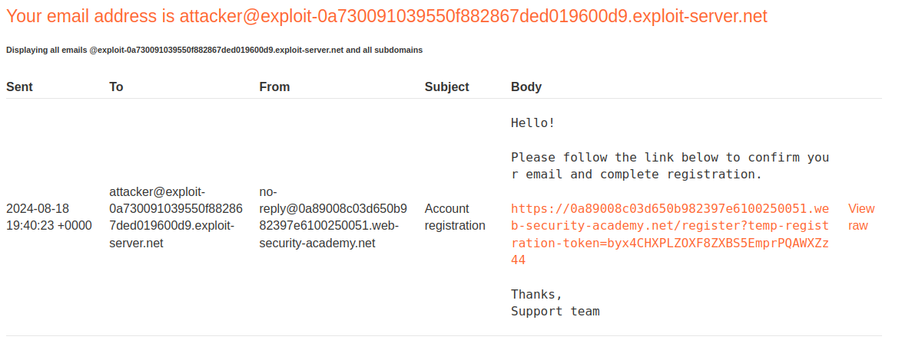
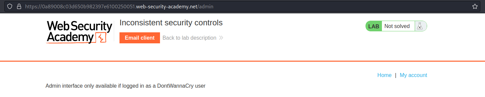
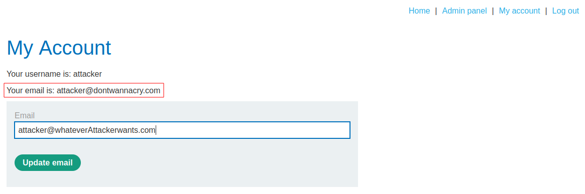
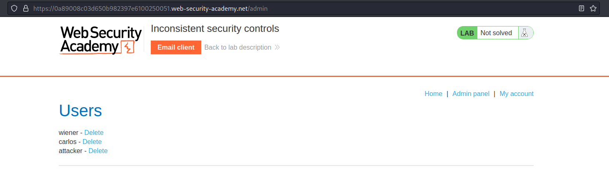

# Inconsistent security controls
# Objective
This lab's flawed logic allows arbitrary users to access administrative functionality that should only be available to company employees. To solve the lab, access the admin panel and delete the user `carlos`.

# Solution
## Analysis
Application possibly treats users from domain `@dontwannacry.com` differently than others.
||
|:--:| 
| *Item is too expensive* |
||
| *Registration confirmation email* |

## Exploitation
### Content discovery
```
$ gobuster dir -u https://0a89008c03d650b982397e6100250051.web-security-academy.net/ -w /usr/share/wordlists/dirbuster/directory-list-2.3-medium.txt\
...
/login                (Status: 200) [Size: 3393]
/register             (Status: 200) [Size: 3578]
/product              (Status: 400) [Size: 30]
/admin                (Status: 401) [Size: 2821]
...

```
||
|:--:| 
| *Access to admin panel is restricted* |

### Abuse of no new email confirmation
||
|:--:| 
| *Changed email* |
||
| *Access to admin panel* |