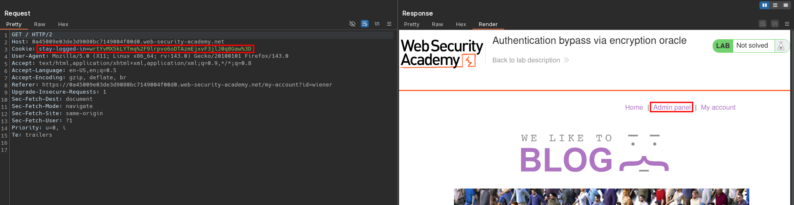

# Authentication bypass via encryption oracle
# Objective
This lab contains a logic flaw that exposes an encryption oracle to users. To solve the lab, exploit this flaw to gain access to the admin panel and delete the user carlos.

You can log in to your own account using the following credentials: `wiener:peter`

# Solution
## Analysis
The website has `Stay logged in` functionality.

||
|:--:| 
| *Stay logged in functionality* |

When user provides invalid email address, there is a error information using encrypted `notification` cookie.
||
|:--:| 
| *Invalid email address* |

## Exploitation
To display information about invalid email, website decrypts value from `notification` cookie. This cookie can be used to decrypt the value of `stay-logged-in` cookie. 

To dencrypt any data attacker can use `POST /post/comment` request.
||
|:--:| 
| *Decrypting data* |

To encrypt any data attacker can use `GET /post?postId=9` request with `notification` cookie.
||
|:--:| 
| *Encrypting data* |

Knowing the structure of `stay-logged-in` cookie attacker can attempt to forge it. To do this successfully string: `Invalid email address: ` must be stripped.


Original value:
```
wiener:1759255788916
```

Target value:
```
administrator:1759255788916
```

In order to skip 23 bytes string `Invalid email address: `, the payload must be padded with 9 bytes (letters). Then first 32 (23+9) bytes must be cut out.

||
|:--:| 
| *Input length error* |

||
|:--:| 
| *Encrypting new cookie value* |
||
| *Cookie modification - deleting first 32 bytes using regex `^([0-9a-f]{2}\s){32}`* |
||
| *Cookie modification - encoding cookie* |
||
| *Cookie verification* |
||
| *Using forged cookie* |
||
| *Deletion of user Carlos* |
