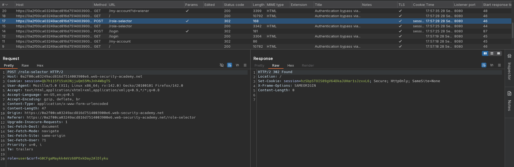

# Authentication bypass via flawed state machine
# Objective
This lab makes flawed assumptions about the sequence of events in the login process. To solve the lab, exploit this flaw to bypass the lab's authentication, access the admin interface, and delete the user carlos.

You can log in to your own account using the following credentials: `wiener:peter` 

# Solution
## Analysis
Log in process has follwing steps:
1. Provide username and password to `/login` enpoint.
2. Provide your role to `/role-selector` endpoint - `user` role or `content-author` role.

||
|:--:| 
| *Role selector functionality* |

## Exploitation
If user drops the `/role-selector` request he will be granted administrator access.

