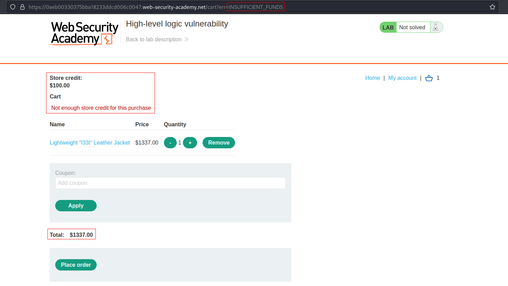
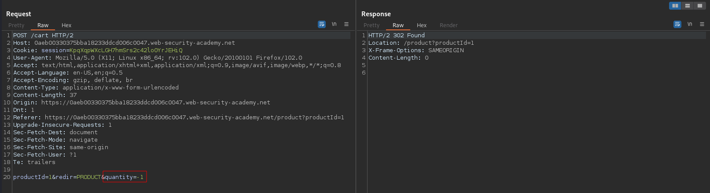
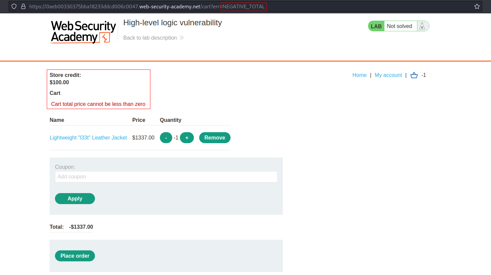
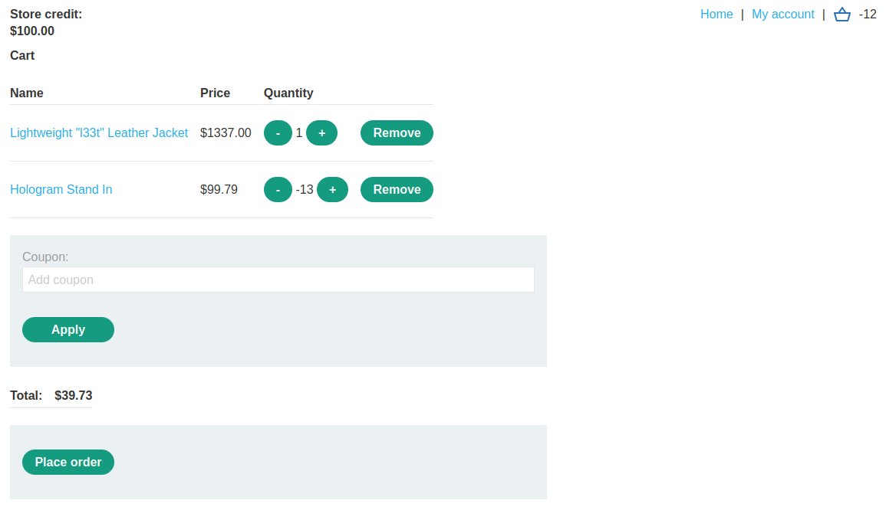
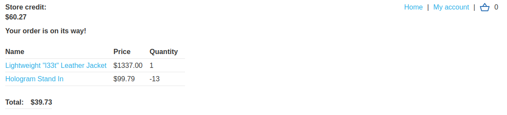

# High-level logic vulnerability
# Objective
This lab doesn't adequately validate user input. You can exploit a logic flaw in its purchasing workflow to buy items for an unintended price. To solve the lab, buy a "Lightweight l33t leather jacket".

You can log in to your own account using the following credentials: `wiener:peter`

# Solution
## Analysis
Initially application do not allow to buy item which price is above `Store credit`.
||
|:--:| 
| *Item is too expensive* |

## Exploitation
Modification of the `Add to cart` request allows to change the quantity of a selected item to `-1`.

||
|:--:| 
| *Modified request - quantity is set to -`* |
||
| *Result* |

Addidng other items with negative quantity to cart will bypass this condition.
||
|:--:| 
| *Extra items added to lower the price of "Lightweight l33t leather jacket"* |
||
| *Result* |