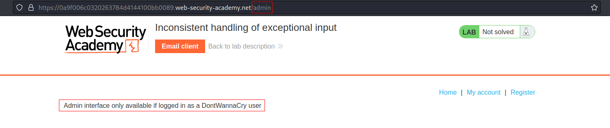
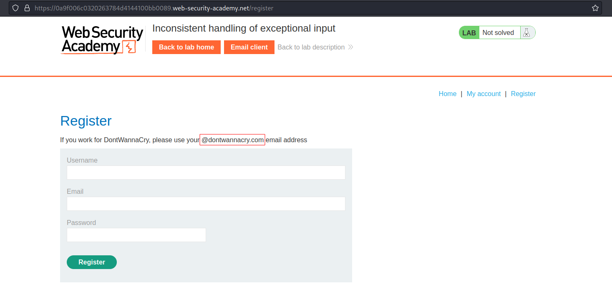
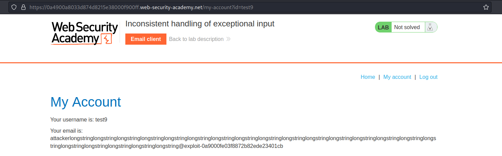
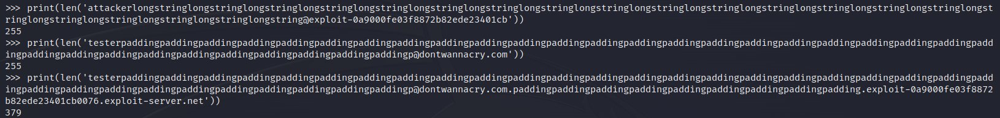
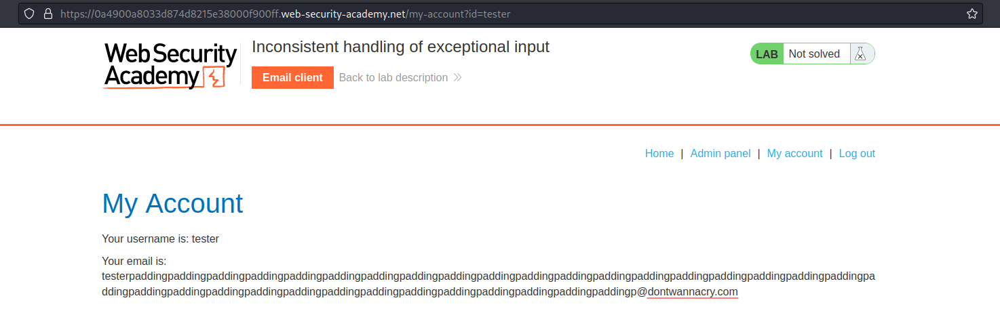

# Inconsistent handling of exceptional input
# Objective
This lab doesn't adequately validate user input. You can exploit a logic flaw in its account registration process to gain access to administrative functionality. To solve the lab, access the admin panel and delete the user `carlos`.

# Solution
## Analysis

Application possibly treats users from `@dontwannacry.com` domain differently than others.
||
|:--:| 
| *Admin panel for DontWannaCry users* |
||
| *Registration panel* |

Long enough email (above `255` characters) will be shortened.
||
|:--:| 
| *Shortened email* |
||
| *Efective email* |

## Exploitation
Using the appropiate amount of padding and combined domains attacker can create acount than would be in `@dontwannacry.com` domain
```
testerpaddingpaddingpaddingpaddingpaddingpaddingpaddingpaddingpaddingpaddingpaddingpaddingpaddingpaddingpaddingpaddingpaddingpaddingpaddingpaddingpaddingpaddingpaddingpaddingpaddingpaddingpaddingpaddingpaddingpaddingpaddingpaddingpaddingp@dontwannacry.com.paddingpaddingpaddingpaddingpaddingpaddingpaddingpaddingpadding.exploit-0a9000fe03f8872b82ede23401cb0076.exploit-server.net
```
||
|:--:| 
| *Malicious email* |
||
| *Malicious email* |
||
| *Admin panel access* |