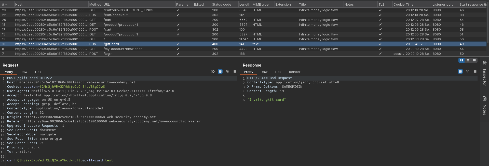
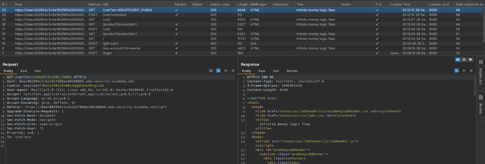
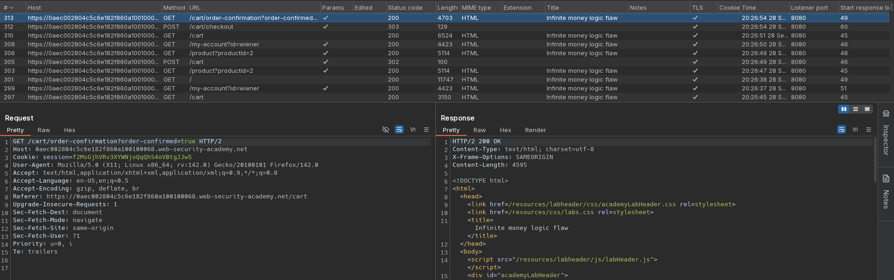
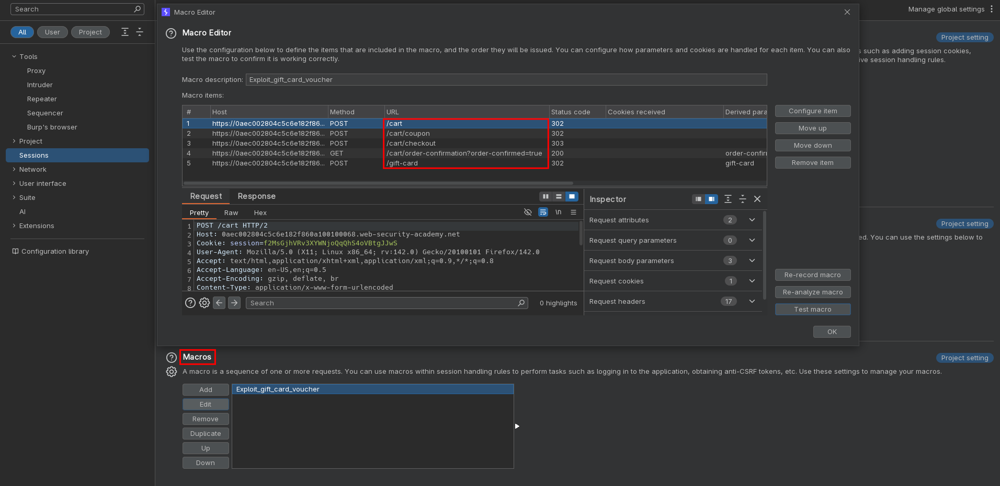
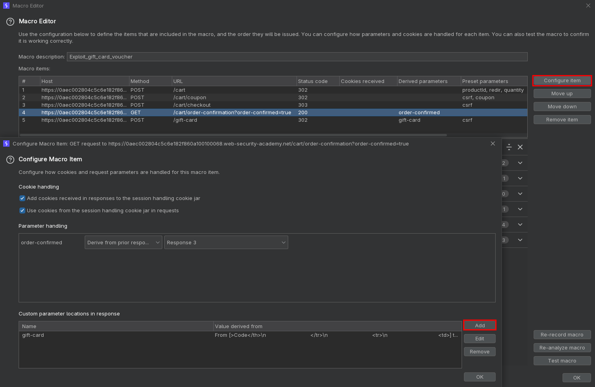
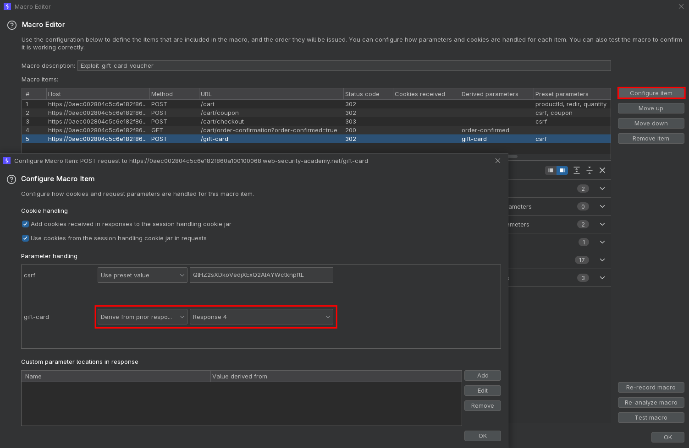
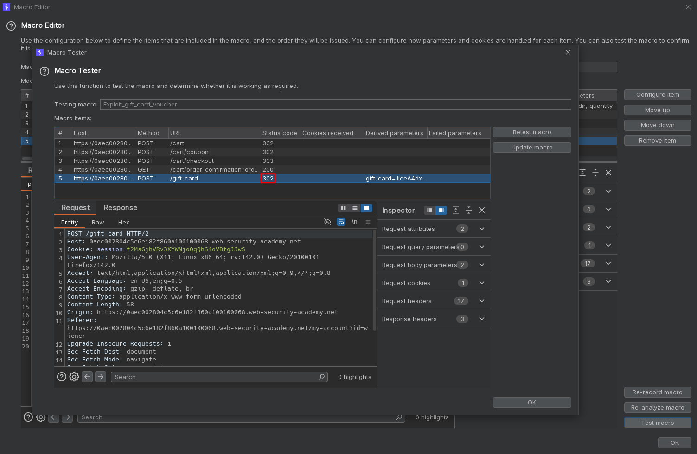
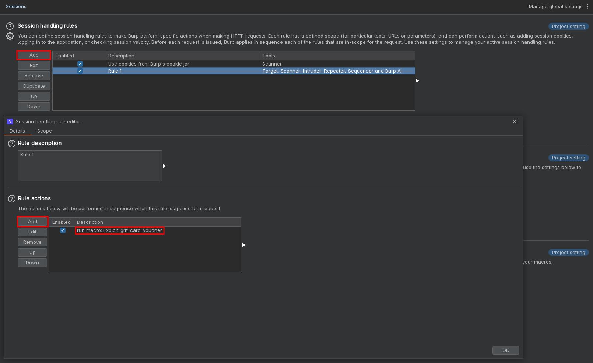
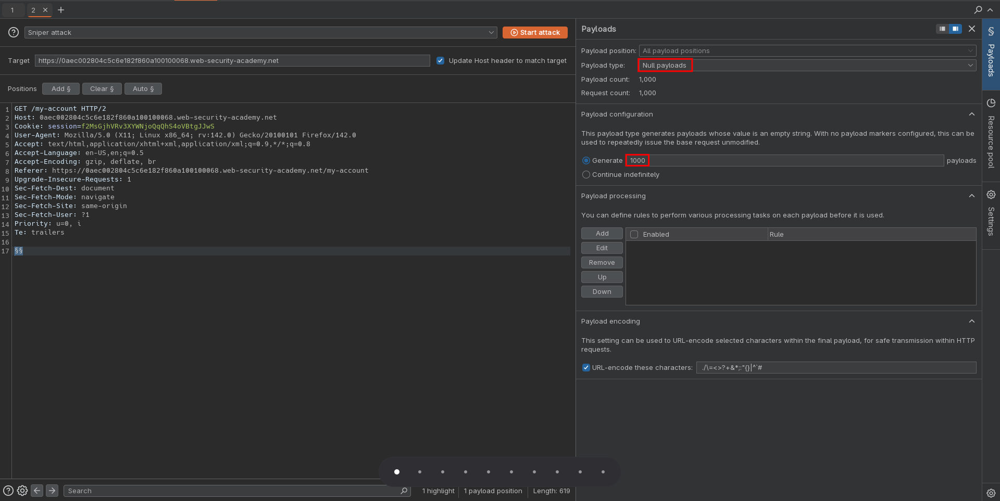
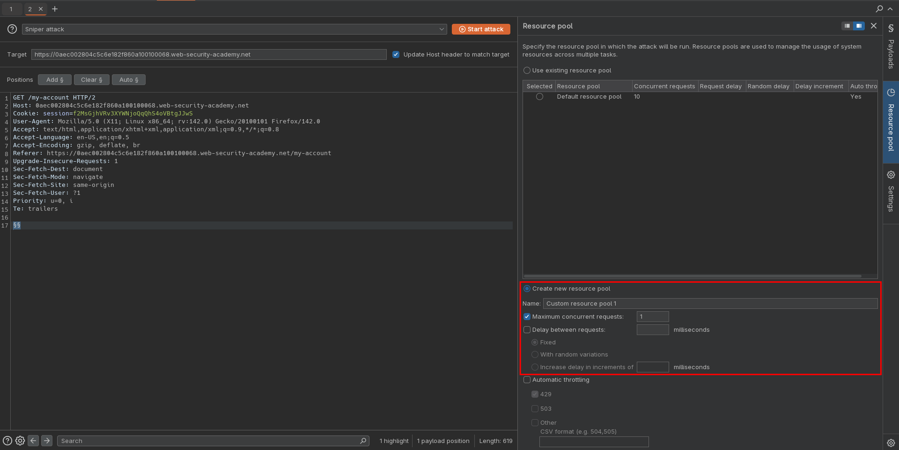

# Infinite money logic flaw
# Objective
This lab has a logic flaw in its purchasing workflow. To solve the lab, exploit this flaw to buy a "Lightweight l33t leather jacket".

You can log in to your own account using the following credentials: `wiener:peter`

# Solution
## Analysis
Initially application do not allow to buy item which price is above `Store credit`. Website has gift card functionality. Signing up for newsletter gives a customer coupon code `SIGNUP30`. Using this coupon gives user back `3$` as gift card.

||
|:--:|
| *Test of gift card functionality* |
||
| *Item is too expensive* |
||
| *Item is too expensive* |
||
| *Example purchase* |

## Exploitation
Using coupon code for buying gift card allows to gain `3$` with each transaction. To automate process of purchasing new gift cards with coupon code and applying new gift cards attacker can create a macro.

||
|:--:|
| *Macro configuration - configured requests* |
||
| *Macro configuration - deriving gift card value* |
||
| *Macro configuration - setting prvious gift card value* |
||
| *Macro configuration - testing* |
||
| *Session handling rules configurtion* |
||
| *Intruder configuration configurtion* |
||
| *Intruder configuration configurtion* |

