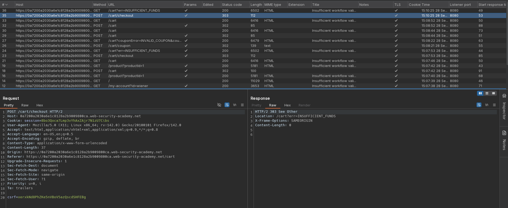
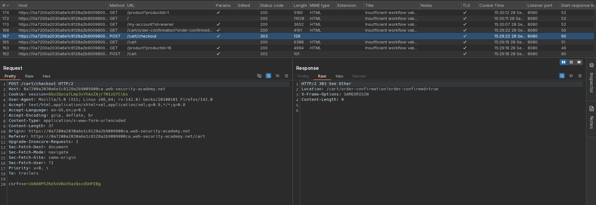
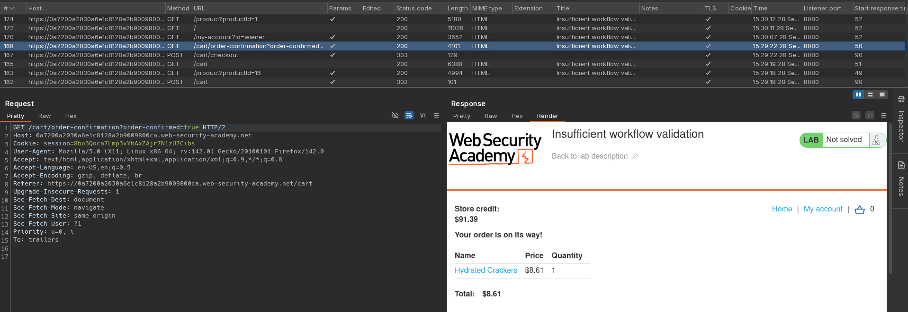

# Insufficient workflow validation
# Objective
This lab makes flawed assumptions about the sequence of events in the purchasing workflow. To solve the lab, exploit this flaw to buy a "Lightweight l33t leather jacket".

You can log in to your own account using the following credentials: `wiener:peter`

# Solution
## Analysis
Initially application do not allow to buy item which price is above `Store credit`.

||
|:--:| 
| *Item is too expensive* |

||
|:--:| 
| *Example purchase* |
||
| *Example purchase* |

## Exploitation
If user navigates to `/cart/order-confirmation?order-confirmed=true` after placing any items in the cart, all the items will be bought - this behaviour skips `/checkout` step.

||
|:--:| 
| *Succcessful purchase* |