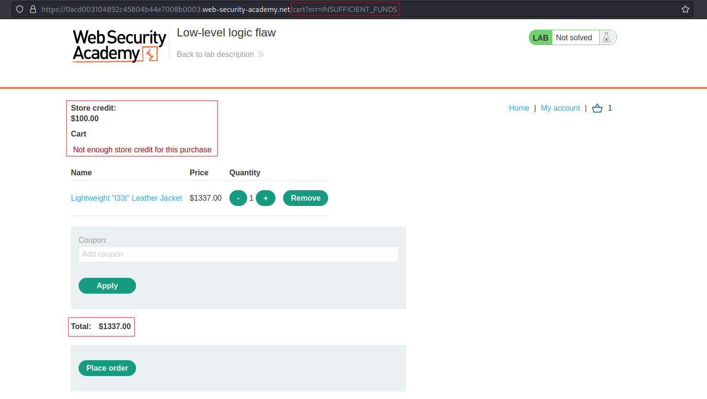
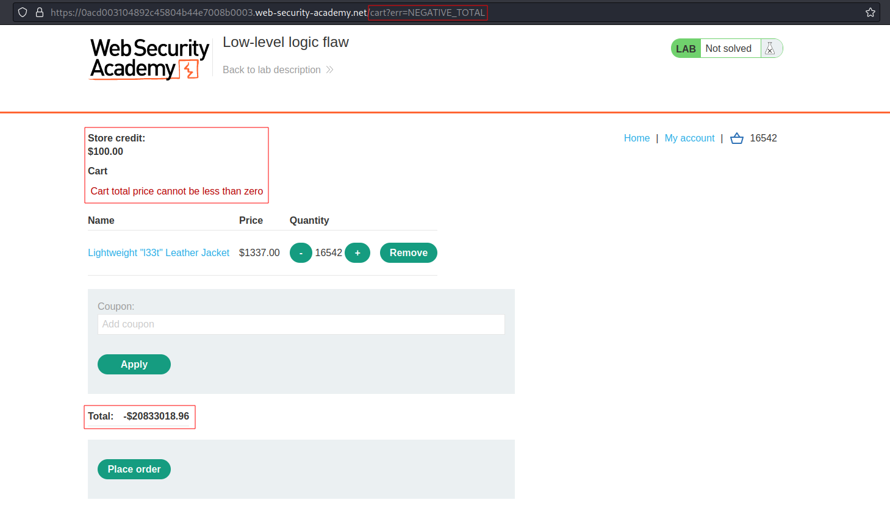
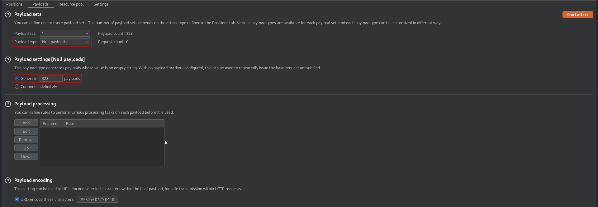
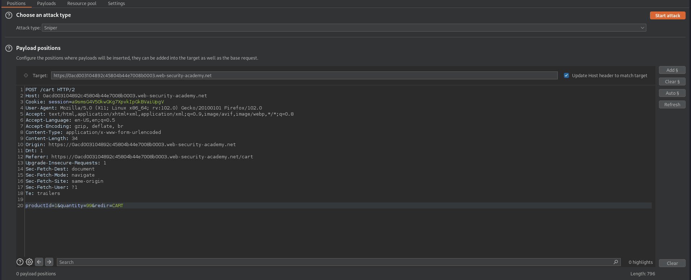

# Low-level logic flaw
# Objective
This lab doesn't adequately validate user input. You can exploit a logic flaw in its purchasing workflow to buy items for an unintended price. To solve the lab, buy a "Lightweight l33t leather jacket".

You can log in to your own account using the following credentials: `wiener:peter`

# Solution
## Analysis
Initially application do not allow to buy item which price is above `Store credit`.
||
|:--:| 
| *Item is too expensive* |

## Exploitation
### Manual overflow
By trying to order a large number o a certain product it is possible to overflow the price variablie. This results in price being negative value. The amount of items can be increased by 2 digit number (`99` at maximum), before receiving `HTTP 400 Bad request` - `Invalid parameter: quantity`.

||
|:--:| 
| *Price is negative value* |

Max price value is `2 147 483 647` --- `log2(2 147 483 648) = 31`

||
| *Final result* |

### Intruder overflow

Below is example using `Null payload` option in Burp Suite Intruder.

||
|:--:| 
| *Payload position - none* |
||
| *Payload type - Null payload - Generate 323 payloads* |
||
| *Resource pool - Maximum concurent requests = 1* |
