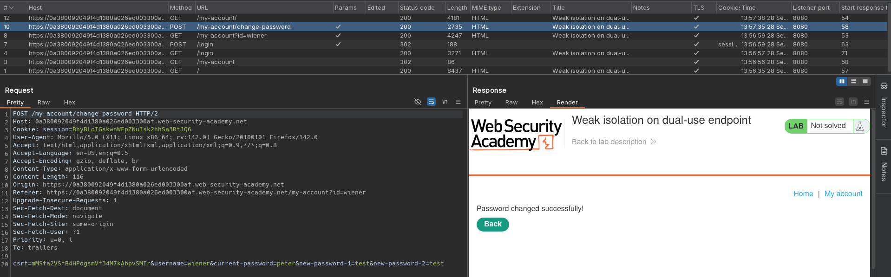
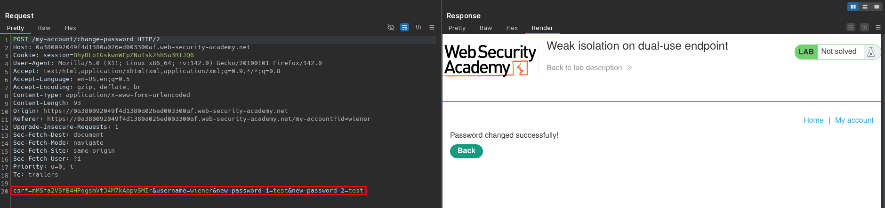
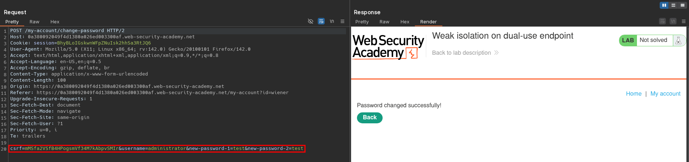
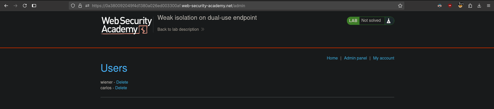

# Weak isolation on dual-use endpoint
# Objective
This lab makes a flawed assumption about the user's privilege level based on their input. As a result, you can exploit the logic of its account management features to gain access to arbitrary users' accounts. To solve the lab, access the `administrator` account and delete the user `carlos`.

You can log in to your own account using the following credentials: `wiener:peter`

# Solution
## Analysis
The website has `Change Password` functionality.

||
|:--:| 
| *Test of change password functionality* |

## Exploitation
Absence of `current-password` value in `Change Password` requests results in valid requests.

||
|:--:| 
| *Change password request without old password* |
||
| *Changing administrator password* |
||
| *Deletion of user Carlos* |
