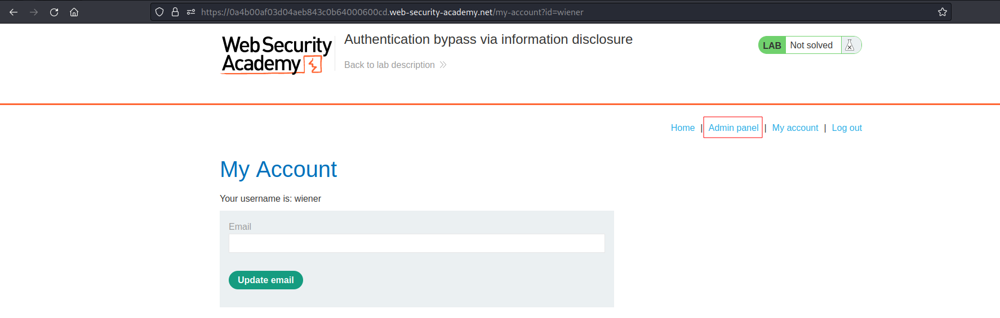

# Authentication bypass via information disclosure
# Objective
This lab's administration interface has an authentication bypass vulnerability, but it is impractical to exploit without knowledge of a custom HTTP header used by the front-end.\
\
To solve the lab, obtain the header name then use it to bypass the lab's authentication. Access the admin interface and delete the user carlos.\
\
You can log in to your own account using the following credentials: `wiener:peter`

# Solution
||
|:--:| 
| *Normal request* |
||
| *TRACE request - custom header with user IP* |
||
| *Adding new header to all requests* |
||
| *New option - Admin panel* |
||
| *Deleting user carlos* |