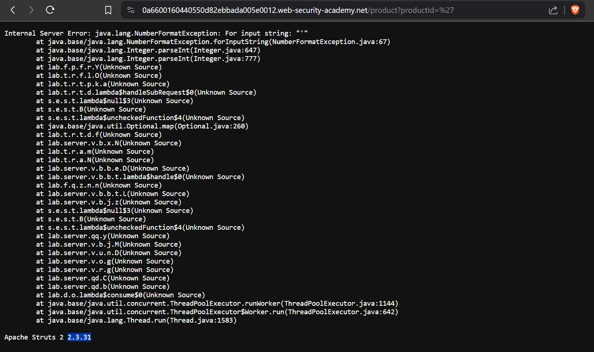

# Information disclosure in error messages
# Objective
This lab's verbose error messages reveal that it is using a vulnerable version of a third-party framework. To solve the lab, obtain and submit the version number of this framework.

# Solution
||
|:--:| 
| Payload: `/product?productId='` |