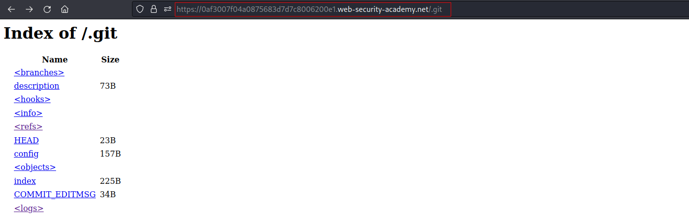
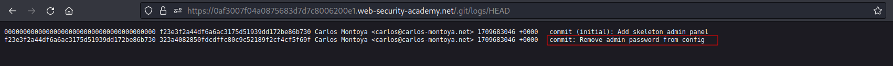

# Information disclosure in version control history
# Objective
This lab discloses sensitive information via its version control history. To solve the lab, obtain the password for the administrator user then log in and delete the user carlos.

# Solution
||
|:--:| 
| *Git directory* |
||
| *Removal of admin password* |
||
| *Administrator's password* |