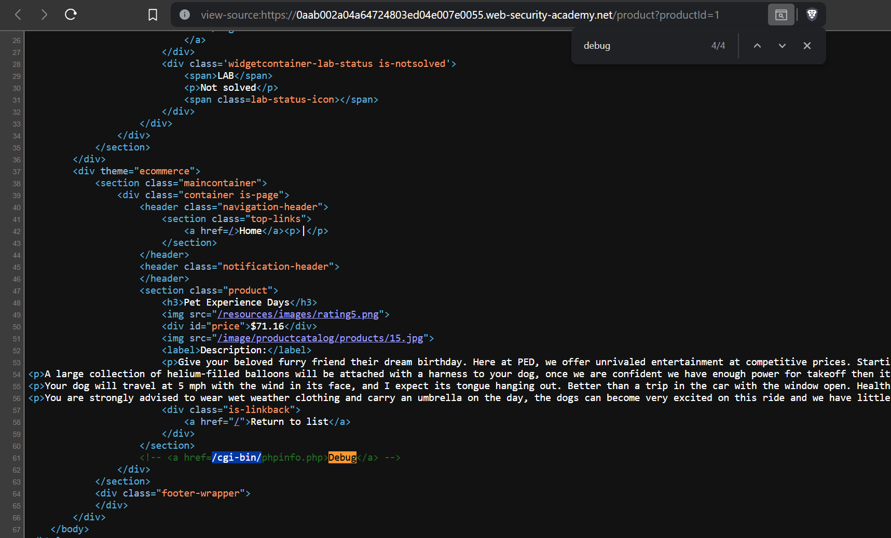
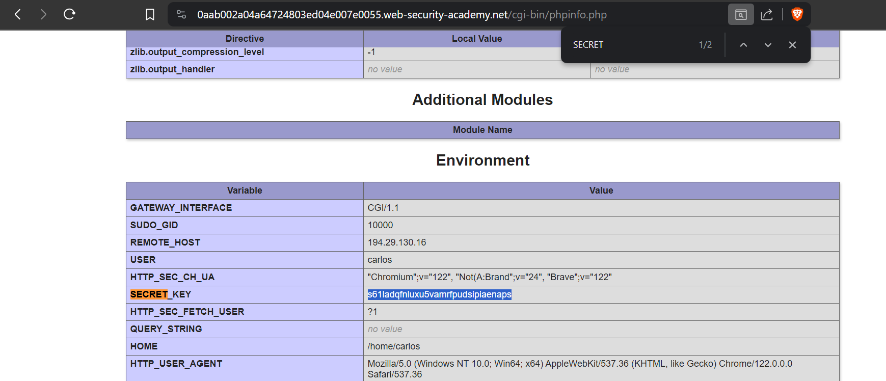

# Information disclosure on debug page
# Objective
This lab contains a debug page that discloses sensitive information about the application. To solve the lab, obtain and submit the SECRET_KEY environment variable.

# Solution
||
|:--:| 
| *Comment in page source revils debug page* |
||
| *Secret key* |
