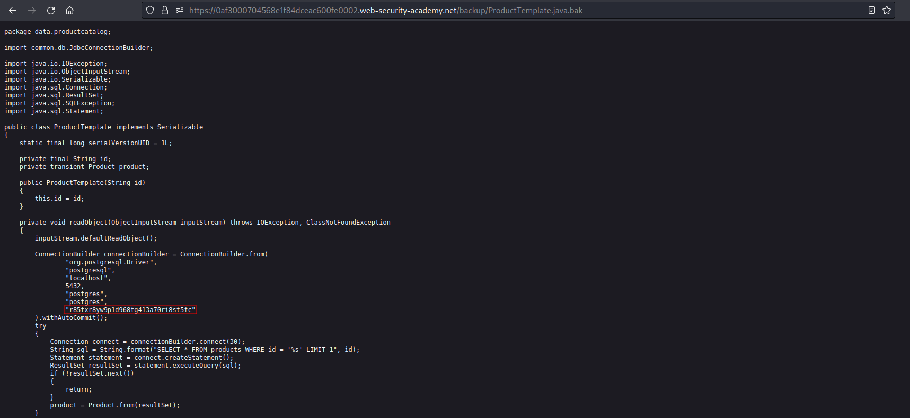

# Source code disclosure via backup files
# Objective
This lab leaks its source code via backup files in a hidden directory. To solve the lab, identify and submit the database password, which is hard-coded in the leaked source code.

# Solution
||
|:--:| 
| *Hidden directory* |
||
| *Backup fille with database password* |
