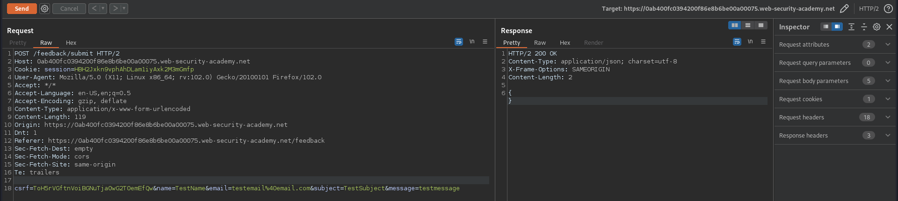
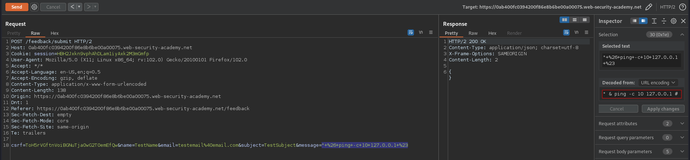
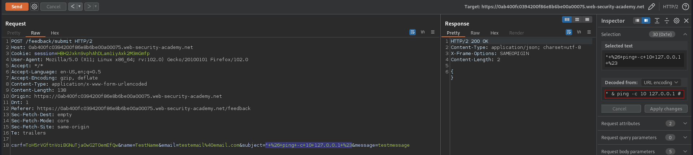
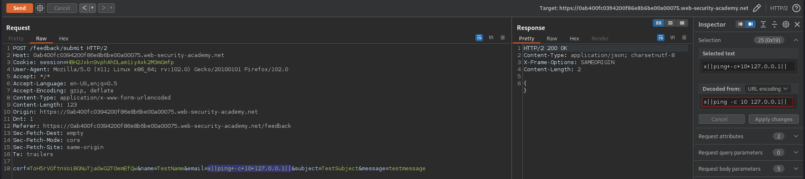

# Blind OS command injection with time delays
# Objective
This lab contains a blind OS command injection vulnerability in the feedback function. \
The application executes a shell command containing the user-supplied details. The output from the command is not returned in the response. \
To solve the lab, exploit the blind OS command injection vulnerability to cause a 10 second delay.

# Solution
||
|:--:| 
| *Submiting feedback* |

||
|:--:| 
| *Time delay using ping in message parameter* |
||
| *Time delay using ping in message parameter* |
||
| *Time delay using ping in message parameter* |
