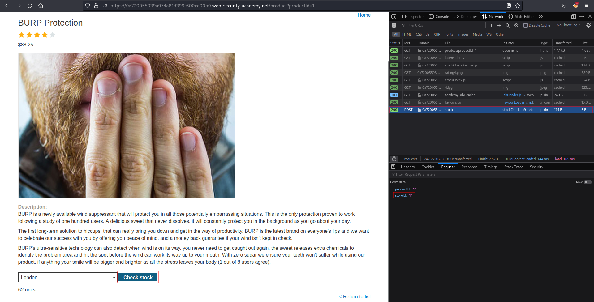
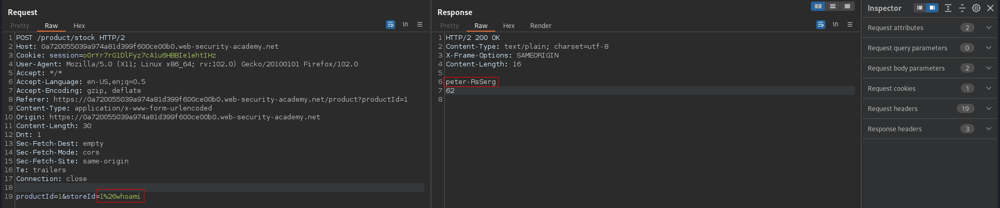

# OS command injection, simple case
# Objective
This lab contains an OS command injection vulnerability in the product stock checker.\
The application executes a shell command containing user-supplied product and store IDs, and returns the raw output from the command in its response.\
To solve the lab, execute the whoami command to determine the name of the current user.

# Solution
`Chceck stock` funcionality allows user to check available numer of a certain product. Clicking on button Check stock sends POST request with 1 or 2 or 3 storeID.

||
|:--:| 
| *`Check stock` request* |

By URL endocoding `1&whoami` it is possible to get username

||
|:--:| 
| *Modified `Check stock` request* |