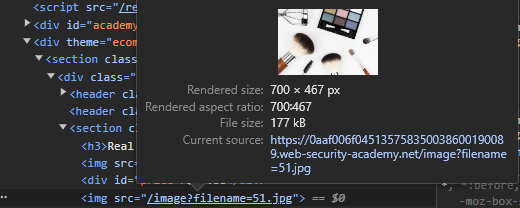

# File path traversal, simple case
# Objective
This lab contains a path traversal vulnerability in the display of product images. To solve the lab, retrieve the contents of the `/etc/passwd` file.\

# Solution
Changing filename to:` ../../../etc/passwd` allows for retrival of `/etc/passwd`.
||
|:--:| 
| *Vulnerable object* |