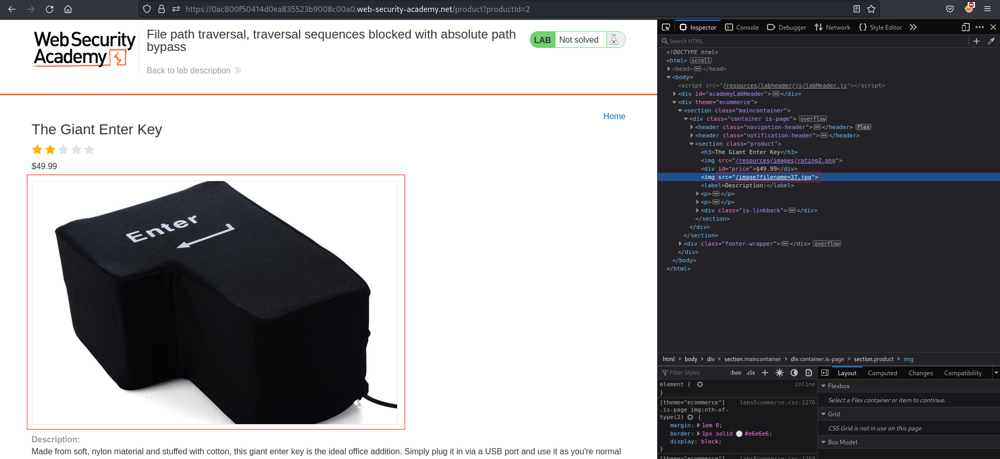
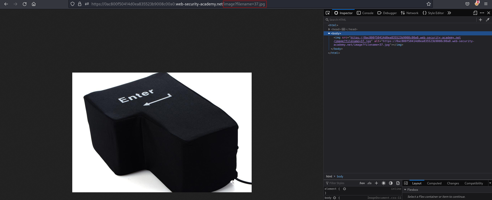
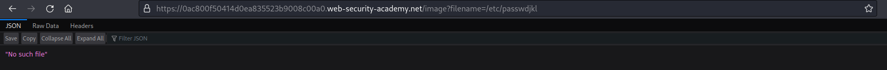
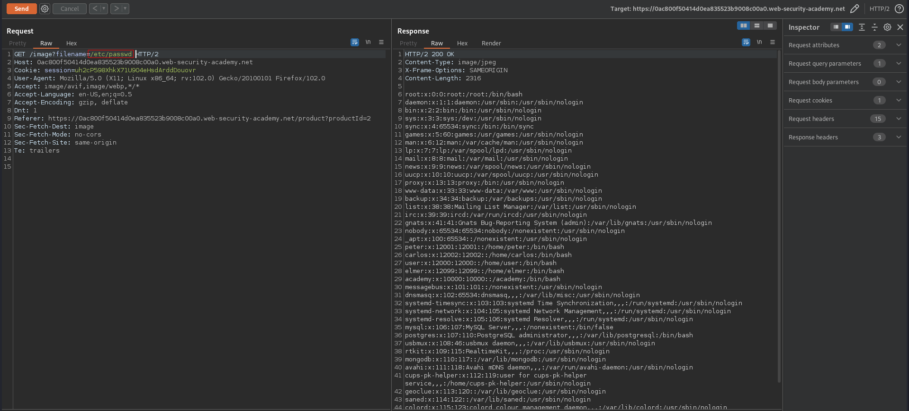

# File path traversal, traversal sequences blocked with absolute path bypass
# Objective
This lab contains a path traversal vulnerability in the display of product images.\
The application blocks traversal sequences but treats the supplied filename as being relative to a default working directory.\
To solve the lab, retrieve the contents of the `/etc/passwd` file.

# Solution
||
|:--:| 
| *Image location* |

||
|:--:| 
| *Retrieval of image using filename parameter* |

||
|:--:| 
| *Test of file traversal* |
||
| *Test of file traversal* |

Tests above showed that `/etc/passwd` is accessible but the content of the file couldn't be rendered corretly, but it worked via BurpSuite Repeater.

||
|:--:| 
| *Retrieval of `/etc/passwd`* |