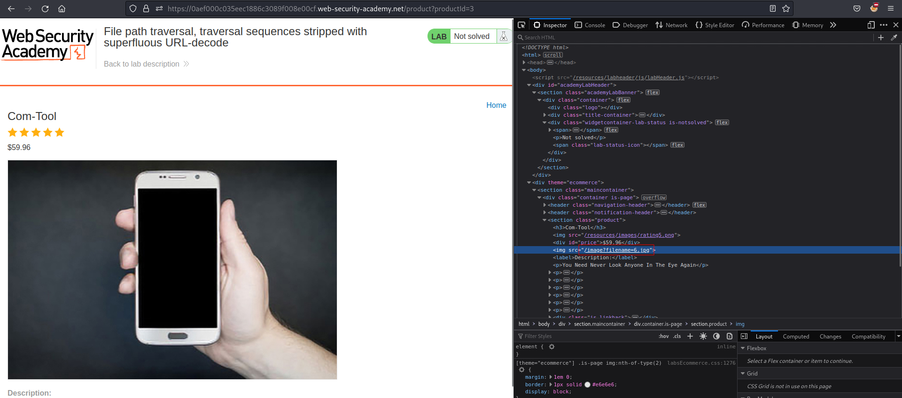
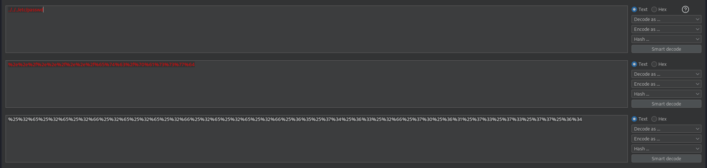
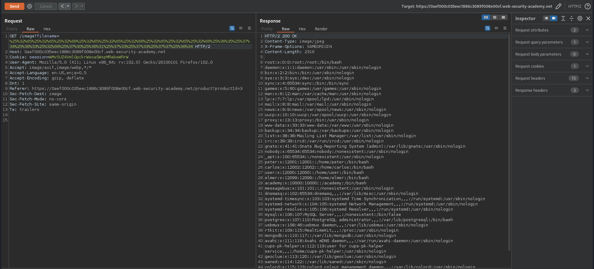

# File path traversal, traversal sequences stripped with superfluous URL-decode
# Objective
This lab contains a path traversal vulnerability in the display of product images.\
The application blocks input containing path traversal sequences. It then performs a URL-decode of the input before using it.\
To solve the lab, retrieve the contents of the /etc/passwd file.
# Solution
||
|:--:| 
| *Image location* |

||
|:--:| 
| *URL encoding 2 times* |

Two times URL encoded payload `../../../etc/passwd` allows for file path traversal.

||
|:--:| 
| *Retrieval of `/etc/passwd`* |