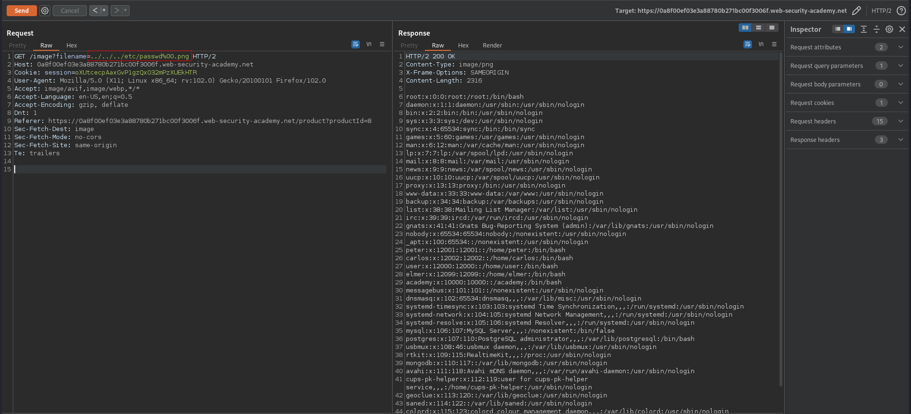

# File path traversal, validation of file extension with null byte bypass
# Objective
This lab contains a path traversal vulnerability in the display of product images. \
The application validates that the supplied filename ends with the expected file extension. \
To solve the lab, retrieve the contents of the /etc/passwd file.
# Solution
||
|:--:| 
| *Image location* |

Application check the file extension. This can be bypassed using null byte - `%00`

||
|:--:| 
| *Retrieval of `/etc/passwd`* |