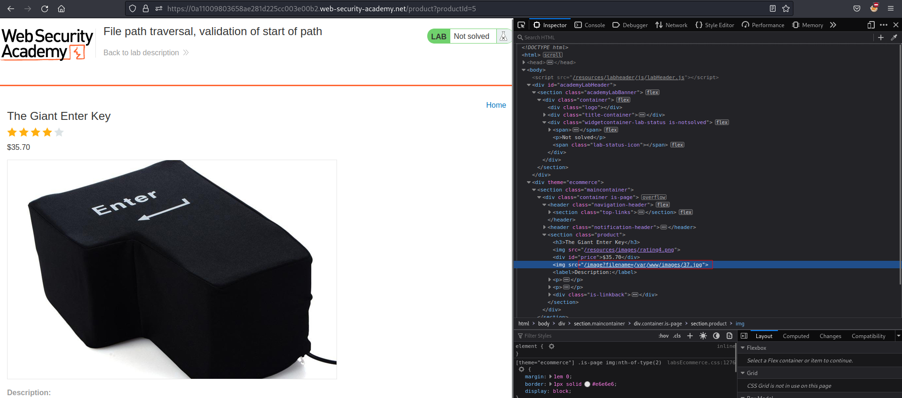
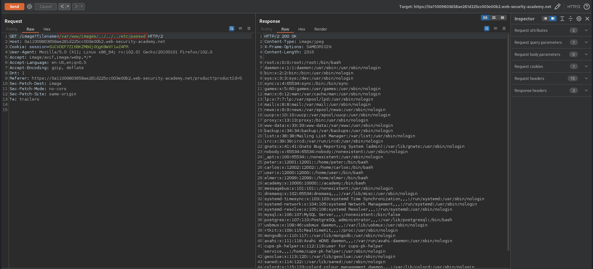

# File path traversal, validation of start of path
# Objective
This lab contains a path traversal vulnerability in the display of product images. \
The application transmits the full file path via a request parameter, and validates that the supplied path starts with the expected folder. \
To solve the lab, retrieve the contents of the /etc/passwd file.
# Solution
||
|:--:| 
| *Image location* |

Application only check swhether a requested filename (path) starts with `/var/www/images/...`

||
|:--:| 
| *Retrieval of /etc/passwd* |