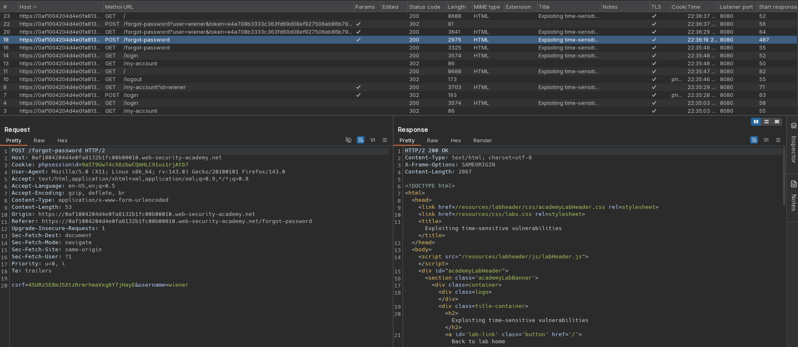
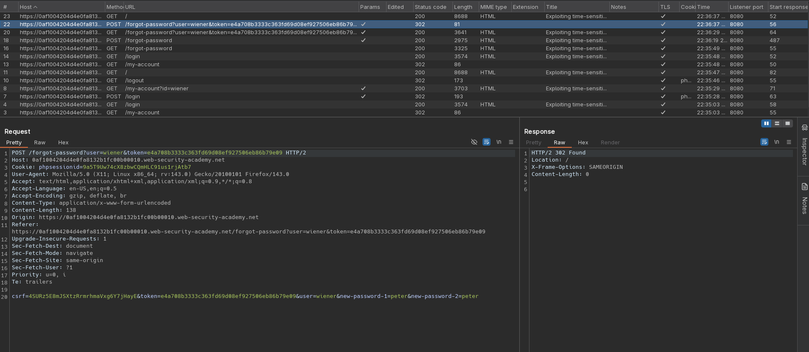
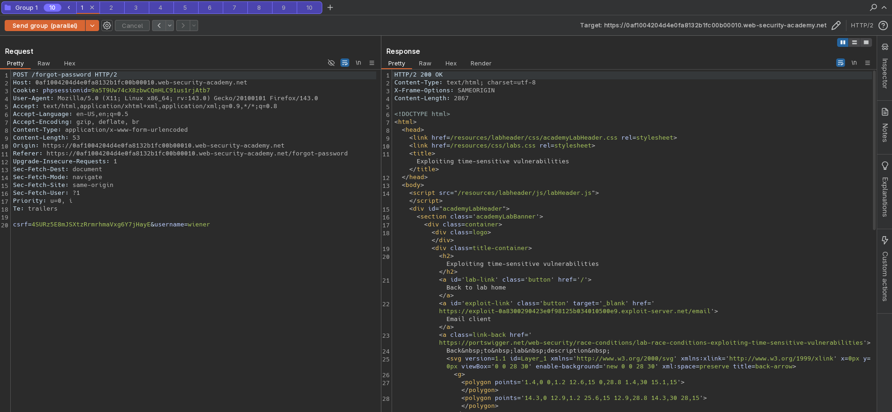
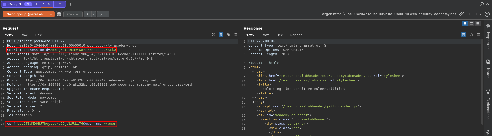
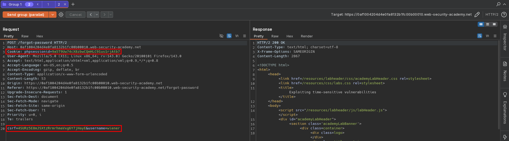
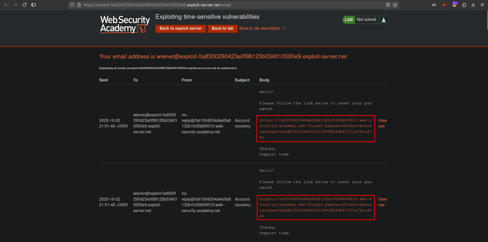
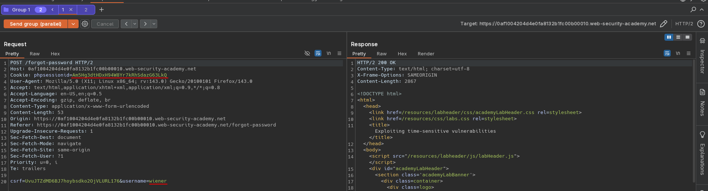
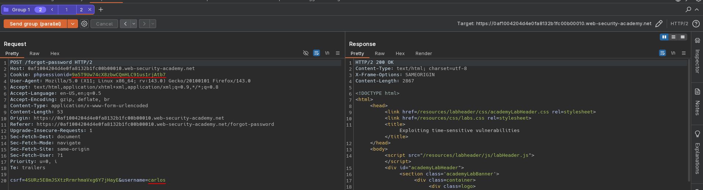
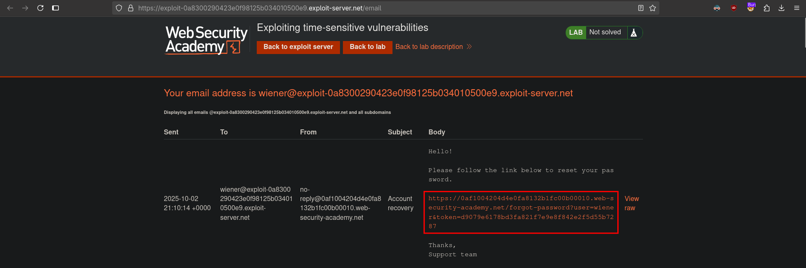
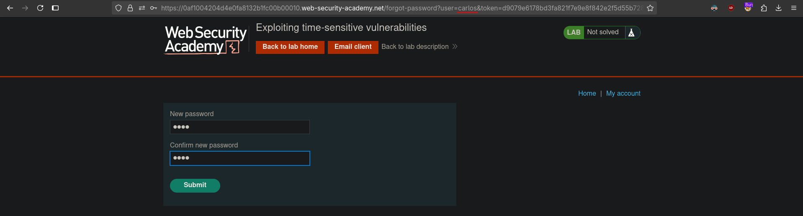

# Exploiting time-sensitive vulnerabilities
# Objective
This lab contains a password reset mechanism. Although it doesn't contain a race condition, you can exploit the mechanism's broken cryptography by sending carefully timed requests.

To solve the lab:
1. Identify the vulnerability in the way the website generates password reset tokens.
2. Obtain a valid password reset token for the user carlos.
3. Log in as carlos.
4. Access the admin panel and delete the user carlos.

You can log into your account with the following credentials: `wiener:peter`. 

# Solution
## Analysis
The website uses tokens in process of reseting user password. Attempting to send reset requests in parallel, results in all token being different - all requests are processed in sequence.

||
|:--:| 
| *Reset password functionality* |
||
| *Reset password functionality - URL from email* |
||
| *Sending reset requests in parallel - All reset tokens are different* |

## Exploitation
Cookie value indicates that website using PHP - server only processes one request at a time per session. Sending same requests with different session cookie value (and CSRF values) allows to execute requests in parallel - reset tokens are identical. This suggests that these tokens are hashed timestamps.

||
|:--:| 
| *First request* |
||
| *Second request - different session* |
||
| *Same token - requests were processed in parallel* |

Sending 2 requests: one with `username=wiener` and second `username=carlos` generates 2 identical reset tokens. By modifing modifying `user` parameter in reset password URL attacker can reset someone's password. 

||
|:--:| 
| *First request* |
||
| *Second request - different session and different user* |
||
| *Received token* |
||
| *Modification of received token - resetting Carlos's passoword* |