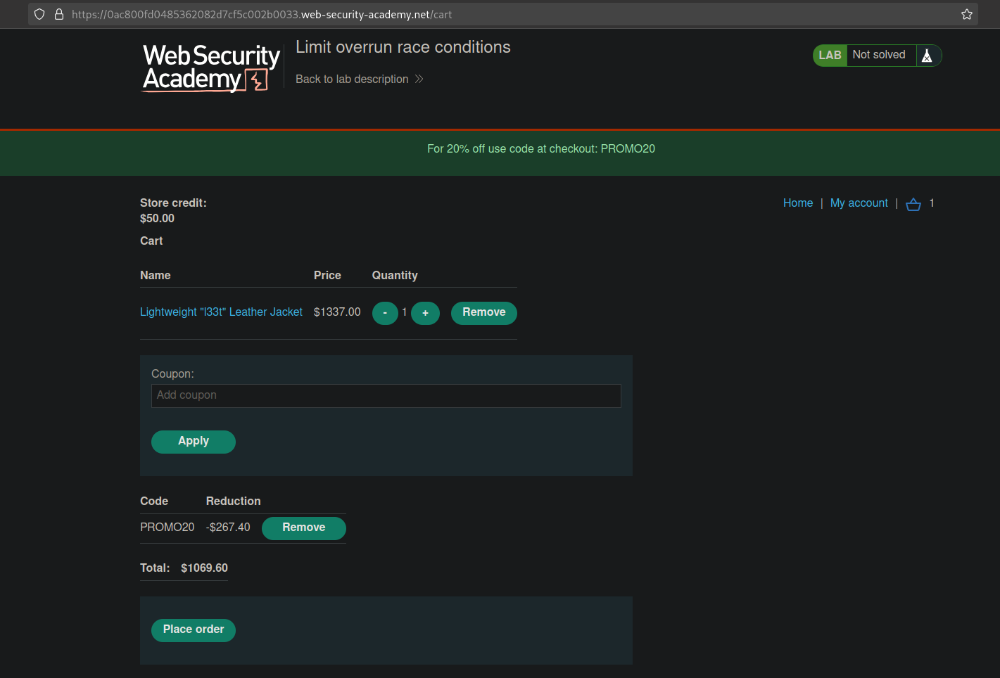

# Limit overrun race conditions
# Objective
This lab's purchasing flow contains a race condition that enables you to purchase items for an unintended price.\
To solve the lab, successfully purchase a Lightweight L33t Leather Jacket.\
You can log in to your account with the following credentials: `wiener:peter`. 

# Solution
## Analysis
Application do not allow to buy item which price is above `Store credit`.
||
|:--:| 
| *There is a discount code available on the website* |
||
| *Checkout* |
||
| *Request with discount code* |
||
| *Duplicated request with discount code* |

## Exploitation
### Exploiting race conditions
In order to reduce price attacker can try to exploit race conditions by sending `POST /cart/coupon` request in parallel (making use of the same  discount code multiple times).

||
|:--:| 
| *Creating tab group* |
||
| *Dublicating tab (request) to 25 tabs (requests)* |
||
| *Modifying send method - Send group in parallel* |
||
| *Result* |
||
| *Result* |
