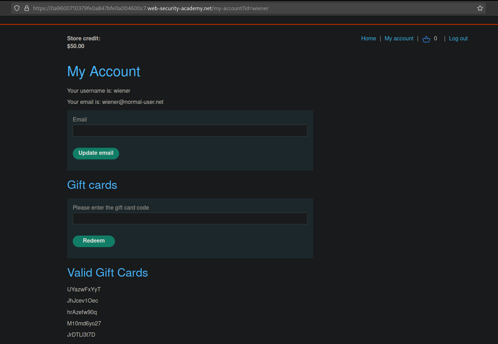
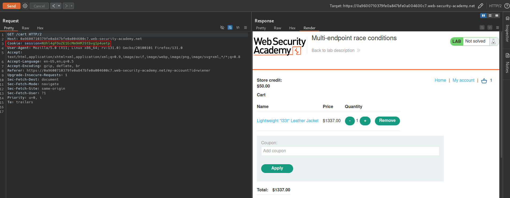
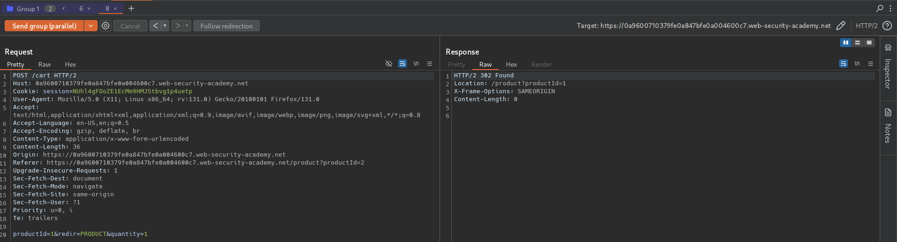
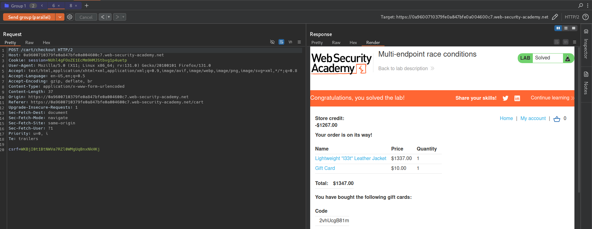

# Multi-endpoint race conditions
# Objective
This lab's purchasing flow contains a race condition that enables you to purchase items for an unintended price.
To solve the lab, successfully purchase a Lightweight L33t Leather Jacket.
You can log into your account with the following credentials: `wiener:peter`.

> When experimenting, we recommend purchasing the gift card as you can later redeem this to avoid running out of store credit. 

# Solution
## Analysis
There is a gift cards which allows users to buy them and redeem them at any time.
||
|:--:| 
| *There are a gift cards to buy and use on the website* |

Any operations on the `/cart` are keyed based on your user session ID.
||
|:--:| 
| *Normal request* |
||
| *Request without session cookie* |

## Exploitation
### Exploiting multi-endpoint race conditions
While performing checkout there is a chance for race conditions. Attacker may try to send `POST /cart/checkout` request and at the same time `POST /cart` (adding another item to his cart). This might cause website to allow transaction which should be blocked due to insufficient credit.

Setup:
1. Add to cart an item (for example gift card).
2. Prepare 2 requests `POST /cart/checkout` and `POST /cart` with addtional item.
3. Send those 2 requests in parallel. This step may need several attempts to exploit this vulnerability.

||
|:--:| 
| *Adding addtional itme to the cart* |
||
| *Successful checkout request with additional item* |

