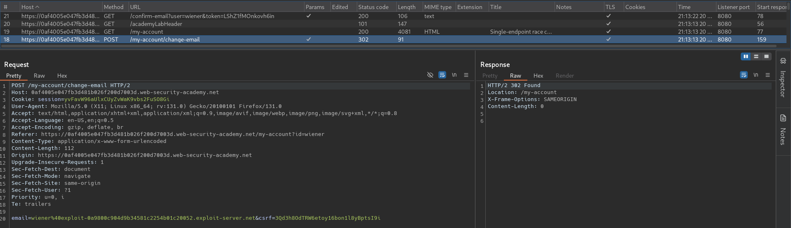
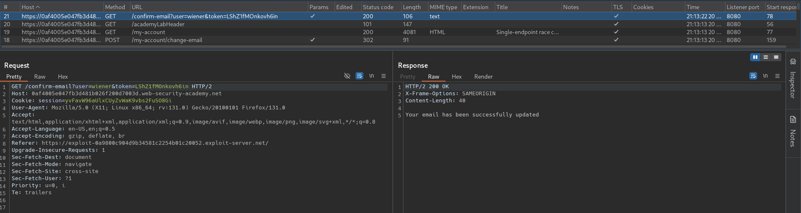
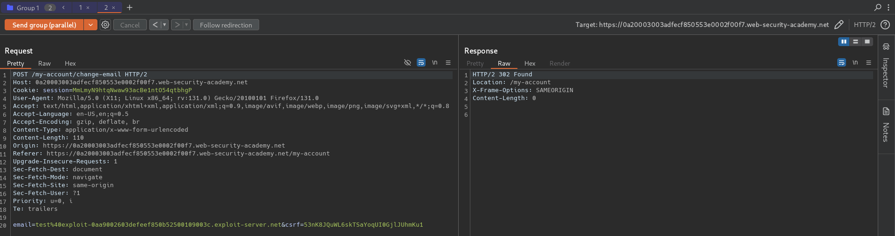
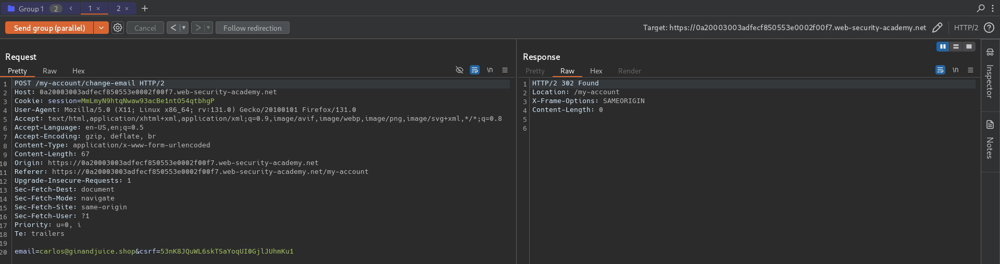
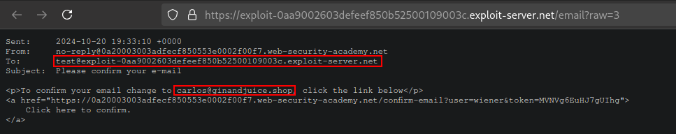
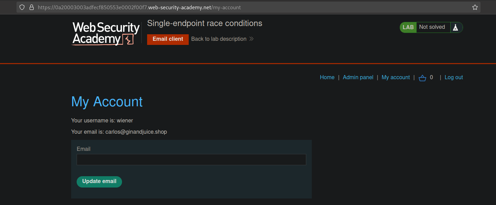
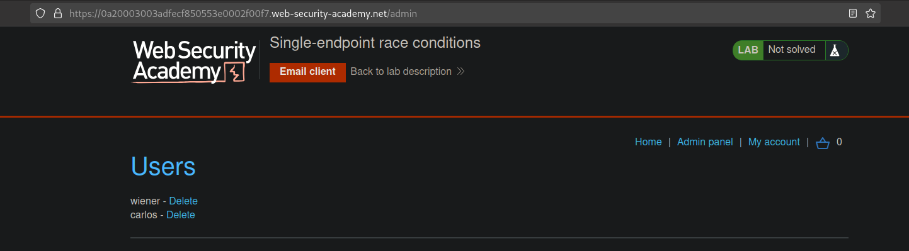

# Single-endpoint race conditions
# Objective
This lab's email change feature contains a race condition that enables you to associate an arbitrary email address with your account.

Someone with the address `carlos@ginandjuice.shop` has a pending invite to be an administrator for the site, but they have not yet created an account. Therefore, any user who successfully claims this address will automatically inherit admin privileges.

To solve the lab:
1. Identify a race condition that lets you claim an arbitrary email address.
2. Change your email address to carlos@ginandjuice.shop.
3. Access the admin panel.
4. Delete the user carlos

You can log in to your own account with the following credentials: `wiener:peter`.

You also have access to an email client, where you can view all emails sent to `@exploit-<YOUR-EXPLOIT-SERVER-ID>.exploit-server.net` addresses. 

# Solution
## Analysis
In order to change email address user has to:
1. Send `POST /my-account/change-email` request with new email address
2. Confirm new email by using the link from the confirmation email.

||
|:--:| 
| *Change email request* |
||
| *New email confirmatin request* |

## Exploitation
### Exploiting single-endpoint race conditions
While performing change email operation there is a chance for race conditions. Attacker may try to send 2 `POST /my-account/change-email` request with different email values. This might cause website to send the confirmation email (with victim email) to attacker.  In this way attacker can take over victim account.

||
|:--:| 
| *Normal change email request* |
||
| *Change email request with victim email* |
||
| *Confirmation email with victim's email address sent to attacker email* |
||
| *Successful email change to victim's email address* |
||
| *Access to admin panel* |