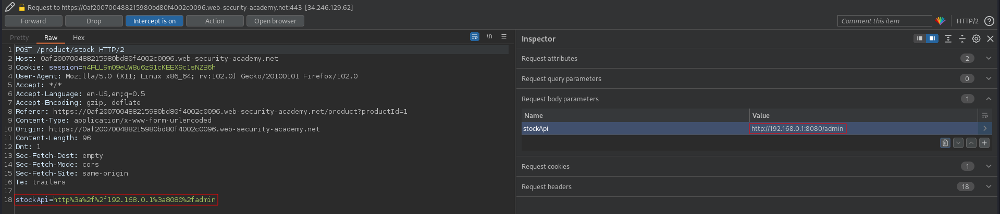
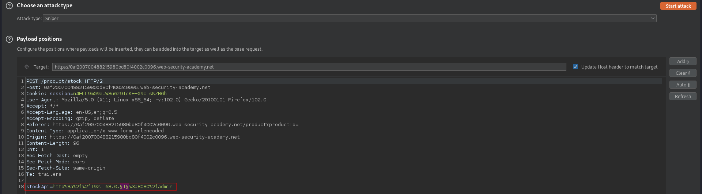
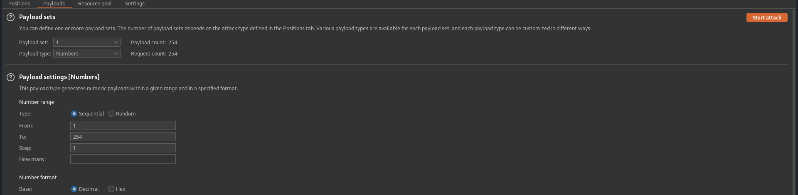
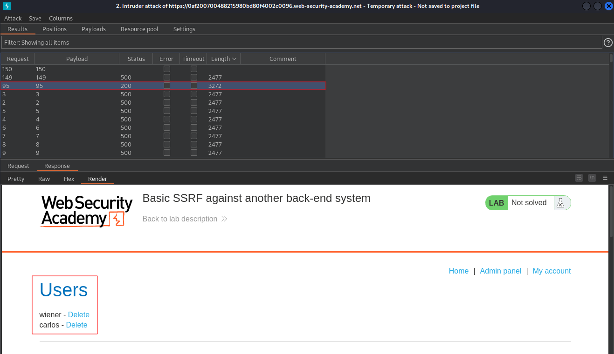
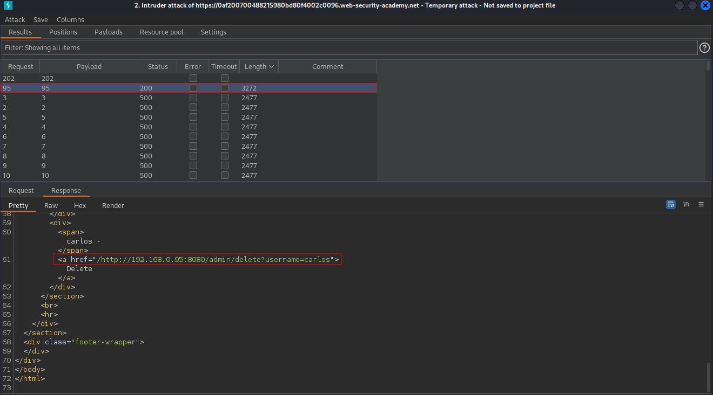
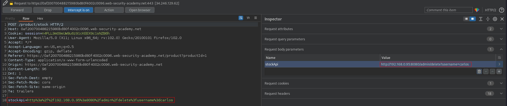

# Basic SSRF against another back-end system
# Objective
This lab has a stock check feature which fetches data from an internal system.\
\
To solve the lab, use the stock check functionality to scan the internal 192.168.0.X range for an admin interface on port 8080, then use it to delete the user carlos.

# Solution
## IP brute force
Website has `Check stock` functionality. In order to find correct admin interface last digit in IP address must be brute-forced.
||
|:--:| 
| *Modification of request* |
||
| *Payload position* |
||
| *Payload settings* |

The admin interface is at `192.168.0.95`
||
|:--:| 
| *Brute forced IP address* |

## SSRF Exploit
||
|:--:| 
| *URL to delete a username* |
||
| *Deletion of user carlos* |
